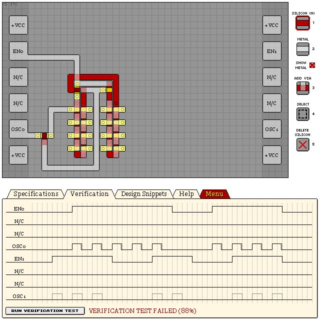

# KO223 - DUAL FIXED FREQUENCY OSCILLATOR

Work in progress

- Verification: Failed (88%)
- Design Score: 181

```
eNrtmVGSgyAQRIH2J2fYK+R/z7L3v8gKikEdB0UhbrahrEp8085IUl2Dds/u6/Fj
H9+2MyWTwvl05ULbOGPtxbFhxhLTIyt0YdrVzAqNINopNGWlFi9OvP7hjLb0HguF
pnRxaB0UUkghhW2FoZ1z2yNQAOJxnobRGUz5OuOQZI5cqt1NZ5Ng/xXhMuHwA34s
040BAxvOxYj+9JQxLWgZ1J9XQ3zqsaIQMcxlhB/9uTiWPNyELzEGbHL5+iNPhyqf
LXy8h0m5oq9fI4mRQrQM0l+OlLQGrWxlYt5dHvtXKPjXIiUlrUI/yipvRpHrwd7S
od2zKlJSWmXDvhHte05ty4sESpaViK+0rOxGXKnqRa+uipSUVnkXq2y8AYdqSlh8
Fugu7XFaXhXNkJT0P2zAW1slVO3wtHjjRUr6kqbpWkHLC7ypKlLSj7DK82+UoBra
furyFBJFRYrYyK23uhtVRZ9VtMhpFTM82RmyqyS9O63zjvsSq5SP8/TixcTWgsQ2
qdVPPOSD/lTwxNPIWfd3tOZaVZGSNrPK5o70Czp3yD4=
```


