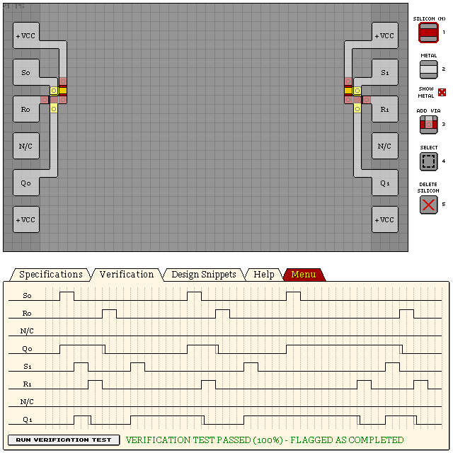

# KL2S1 - DUAL SET-RESET LATCH

- Verification: Passed (100%)
- Design Score: 58

```
eNrtmk0OgyAYRMVh4xl6he57lt7/Im2+mNQ/UKEkoE/CxudEQWdAxT/9Y3i74eV8
l1IuIHRpwt7KaaGzcv1eRYgQIUKEtxRmDHOJA2vGUH6x22HTuT68GZW0WfPpl1vV
eDrNzjvS37aktk+b1xxvERQK/Rv1XQibRX2n1RHHDB4Jh5KhFGryobSEQqHQe9Mm
ojI6dRQ3EQqtmCrD3UTlyTBUmPIODoXWTJXh7pqCtI2o5MGDQplVEpV7XR3rTBGk
UGjNs0qlu7u5qCz+m3s9wkxozys2FNokjft33/sl/oAXjsrtmk8PfutYrCaYLkbg
sYRCq43KXYeG3V1ZIn0A7W/Grw==
```



## See Also

[S/R Latches](/snippets/sr-latch.md)