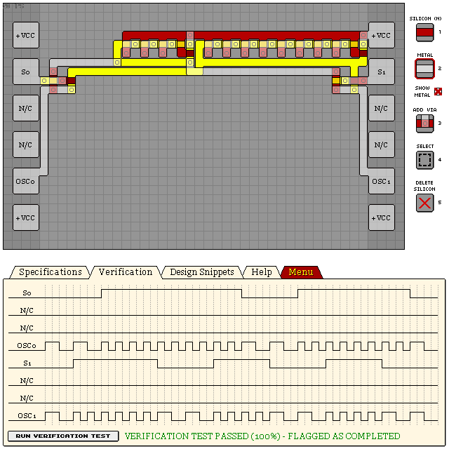

# KO224X - DUAL FREQUENCY OSCILLATOR

- Verification: Passed (100%)
- Design Score: 231

```
eNrtWlF2hCAMlIw/e4Zeof89y97/IlXUVbcw2qArQvT5NQwhEYcEbL/br8fTPX5c
22juGxOdv1UWRWdR/K0iOq3FpmCi7I/okji8eBVRRqtm8ViL8mGiG/1UBqcxi2ax
fIuis/jvhXW26LQKoFxYi8xzfDon8cujAIJPOiq+weJa2e3RDp8GGxjZ2CIy7p7S
wULhqNdyHtp7w/DZ55DnUyN5gbEWCJD/9LA9DNqBEFyEd4Dwy1uGqQsUGwA8HovU
PMqYJ6tuqJ/gcYIYW8EGZ0c/7WHSv+D1253mlp89MXE5VdQiYrpLbQ011FBD60Zz
kEpcxM0PRXlcWDTq5iJh5mT1dWcglcEqe7cYpnAvQaEWlhRROpHLd382djqktGhU
yKViqP26h4obJpVHCRrARTg7lO7vQSiaKRe8Z4FSSEGXFeNmw4WWC9ypKswhq8Q1
3GtKbPAcLCV/y5ELnrEAVUWjQi6gnjnA/Qrw5BOlhcvBY3JWrm6g2lL3MrS03aod
GyzqDNy4d+ByQQNUKKhunHPGfYhUhp90dAr2+x8BlZ6+FSeVqG3hMO5xM0fiynCq
IoWvX3UuyOc=
```



