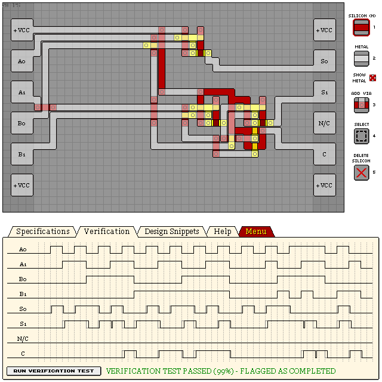

# KA180 - 2-BIT ADDER WITH CARRY

This one needs some work, it seems more complex than it needs to be.

- Verification: Passed (99%)
- Design Score: 320

```
eNrtWl2agyAMlExfeoa9wr7vWfb+F9lVVECSKCCfto1+9m+MCRDHgfTx/fh6/rrn
j3sMNfvbGLrXMRzM0Az7GlKdoZv2YfPd7Rm6bO/fRqoz5AI81MbRI228khzF1iNl
feqOdQ4lfEOyT7lXXRQD41kzDDG4Go/bth9IgOV0V+Zx0BNQTznfq24+Cj1SjUcl
g43lPt1wknMkbxMKgD3a0fEjJkf+HYnfCV02Fp2/r2cIaNYiQ89Ek21Mqw3uf/h/
m0dRO8Hn5ZGrZFGscJ4MFMNxOxbruX2TdQaHMwTU/za/IEN9sEgCK0XHD4ptLeov
TCTYpkOe2XI9vaLxVbqjHSlKpMZD3Gmooe+G4owroykq9GovWNo5JeYPRo0qDW1F
cY1fsHd/oS0aosJFo/CKMRtVWgIYGSJMkXLFAuJFXCEZMmhwB1YpAcoqQja/EzQn
FA2G1Den33Z0I7R8Rq2alSbgTINNc74hVRoZfrRuLFeVCEQqT8Ch5hUEEt6h2cgr
NJqFjEIlNKhTbHiuNDK0CbihN0ODfFOqQOf71atPO4o0lG1Q/YAGVzE61iLfJZVr
lWmtqYxId2wtn1upsq3oHR6xbCmTf0xvbwduwmKl6RuiwhjhdHStchNLWYg0lkJo
Yo2bEX95vTiGs0q0jiK+zKkVcOn2Z9ZCyirg4qLBa1XAO1Mlf7SjkSYRpn6sLGHW
Z+xZeR0a/t510SgAhYp0t0W6XygZy6bkXTIWLbY3UqQ9GUnY/gAe0cj/
```


