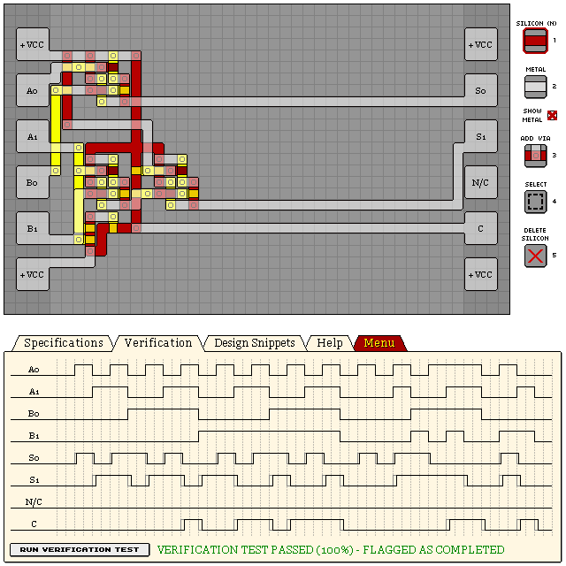

# KA180 - 2-BIT ADDER WITH CARRY

## Half+Full Ripple Adder

[Open in Open-Konstruktor](https://openkonstruktor.natecousins.com/?level=10+KA180+2-BIT+ADDER+WITH+CARRY&design=eNrtmV1ywyAMhIs2LzlDr5D3nqX3v0gnjI1BSMI%2FdcaZrD2pU39dIyisxej2uH3ff9P9J92%2B9pxvLRR1rhCm5tzUooRty6jFPoKeqRZT8%2BTU3AmEOqBU3RHdaz2q9XNTcyetHdX%2BXD0B0jTOsnXmhP%2FT0ZRL3vyJhcG0G09yJ9jPXMgUUkghhRQ%2BhTmdE%2F%2FIFID5OU4zR75KvszXQp%2B%2Fzsyn%2BZnQFJnKTKApZgo0%2FRWZ4py%2BGHSOZAmtolVvFl6NcxWtSevgXQqfSkRlCd6kQkp6JQpjtp%2FpSJ4TrrLKj6fgaJCSfja9ulXWWdt2bZuJaS26N5un7duNtNK%2FKLePBgb9xUlaLhZS0qtaJfwFjp4Yhob276pNdNnvLpvdojU2yb5WxQzddBfzOCMNjbQE4GiNdtdqJdJysZCSXt0q48xwf96I%2Botns5BI69gdQjNEaIZg3khKSqvcZpVtZaXJ0Hpi2Y5dmkGh5WeTGWJJ0bTNNszKKhtuxVyOXWOlOm1khlFGekDLxUJKut8qD9a429q2WcWWYY07omoL7lXA9Ta5yI%2FUuO3NbBWPW%2FU7UgH3a%2BtdQsvqKulbU2vvdk6N%2B1%2Bs0v4cp8Mt9upOVQmcp8Xr30pe%2FuZl0XyDk5Iae8ZXOpJ9%2FAFeK8iu)

- Verification: Passed (100%)
- Design Score: 282

```
eNrtmd11wzAIhSuuXzJDV+h7Z+n+izT+CRYIkO3UaXKCfdy6/nQDUiSMyvA1fF5+
yuW7DB9HzpcWkjo3CIs4d1mk0Db1LLYetExZLOKTi3gSCLVDpXpCutd6VOvPLeJJ
2Tqq7bl5ApRlnGnvzAm/096UK978iYXBtOtPcsfZ91zIKUxhClOYwlE4pXPkHxMF
YF730+sL7foHbu5cbzA9nG+HD6rbjXC8MDVYmhHYzdHY2mYyA80xY7ohaAzGM6ox
MSYb09IBWsxKTIwJa4Nq/DGPxuyYgWns9WzZxLcu+JQiunTBpfSKlKfIGZiS/jOF
MeFPDFdumNwUR9+eIkcjadL3ps8eKuvcbb9WJmNai+bN5mlbu5GW2hfl/tFAp784
SZuLJWnSZw2V8Bc4WmIENMh21Waa+IZ3tKxllbmVVlrlM7Tpxud+RhoGUnbA0Rp2
t2op0uZiSZr02UNlnBkezxtR33hhFhRpnXCHMBgiDIbIvDFp0gyV+0KlrLCIDK0l
VtixSzRgyj9FZog1RdNhVjArqxTc8pmPQ2OlOm1khlFGeoc2F0vSpMdD5X0VpXV7
LH6vQUmkdRZFh6oteF0Lp6oUrrfJLHdK3RRWutv/G4jKHfvjVv1AnTJ3QN0Ce5vQ
ZnU16UtTa+92To37T0Klfd1Pu1vszZ2qEjhPi8e/lbz8zcui8w2eNKmxZ3xkRLKP
X5N5yOg=
```



## See Also

[Logic Gates - XOR](/snippets/logic-gates.md#xor-gate)
