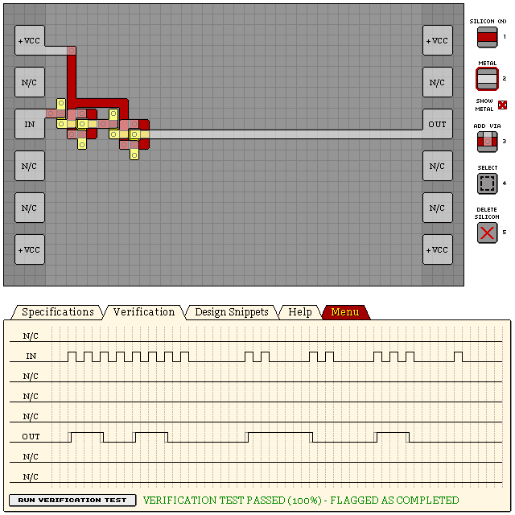

# KC82F - DIVIDE-BY-FOUR COUNTER

## Dual T-Latch design (Best accuracy)

- Verification: Passed (100%)
- Design Score: 99

```
eNrtmUEOgjAQRen8bjiDV3DvWbz/RQQkEks7A1ORAB+iC58/05DmMQPxHm/tM7SP
EBvPeYJg8AXlcy4Khtm5umIfWlGxmdV2VDQvTyloXh59qcGzAYKn4lT1zJucQQYZ
ZJDB8weHdk7Kx0ABZD/1tOMyfad1x9+7v8cGRdzzLJWRFsLvI4UJljKNTW5p33y2
thnW42n5Q2AhJf0n3dJPJS8uEicpKSnptekhVAn9vqM3iVVZo/2E/15ZlSUlJb2m
KqFRlKSEBWKBITTnLJ5b1hoZwshy05KSUpUrVTmIRRWpQqFnLUWrWfg7QwDclqSk
VOUvaVF3GA+3ZgUVA7j6bklXtBiaBQdwUtIDqnLzN94G1Z8Kwhh1/SO2/RQUahbe
npOUlFSh27zj/okq8596uqyrtIb3fXow66GBcMQmJd2E7mCkFxW2xy4=
```


## Dual T-Latch design (Best design score)

- Verification: Passed (100%)
- Design Score: 93

```
eNrtmUESgyAMRYWw8Qy9Qvc9S+9/kYrV6RQIkaS0Vb+MLnz8JsPgL5BwDZfx7sab
C4OmHUDodEI/t81Cl7XmiFEkROWFyoji8HBCcXjqqTrNBBCi1oTKiMf/OiCEEEII
IdyNcF7Oef6aKREVbzuduH8907jL+6l7zJXlzw4l7FdMPA0DlWOv6tiljOP7QnLv
HfLsck4VnI7NLrAHBf0m7WlRnDVu8k5QUFDQc9NdWCV5aSGo/s8iQ86WuClu04KC
gp7TKqtmSJwp0QZjIaqbkt4MyWKGaVqYlqCgsMqu60aq0/TgMtF6/S+bTmCq56mY
lqCgsMp2SmwVaLnqNiusOfX2rrfoXN2QMyYtKOifWmX3ordATRthseCtplJcw2kk
KCgoT/vUuD9ileXbTretKk2b924lEluxyWMDDgqqpD9wpAeyssce
```



## See Also

[T Latches](/snippets/t-latch.md)
