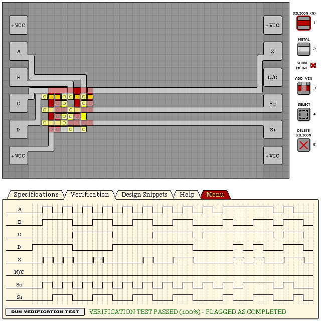
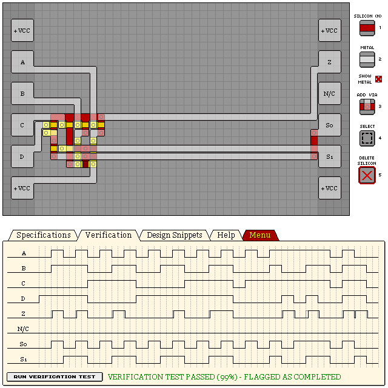

# KM141P - 4-TO-1 MULTIPLEXER

Essentially just a 2-4 line decoder with a simple input switch glued on top.

## 100%

- Verification: Passed (100%)
- Design Score: 206

```
eNrtmWFywiAQhck+/niGXqH/e5be/yJNwSAJy9aASVUeTJzRbx9LHHxZxH/6j8v3
dPmavGvpFHYIJbt2CKdVP0coqbu9QqdL75+qa51qU0a3NyMXOYUUUkghhU8hDOWc
1FugANSrn4bmHWLzbo4PLyn1NSB8mEdtAyTyGWhcIv79PAyh04Q0CptKnaaQgt7u
SnS89MAhekj4AsOtlQGR1wKu7F8D5A15eN8VIAPyuNCtAaQJz2xxmJIfbG2qpd7l
uaSkpKRj0yGsEpWH2q1+hDEy/sgLM6+YI9uz4qIlJaVVnmiGK+8pKbJtcjlytstW
8xraKDdGrs+qunfnoiUlpVUeY5UwtXhKLRctKSmt8mS6OtrRLMuq/TK2t27Ms1aq
WXNWXLSkpK9llf0nSkj/zKVdp3LQbVHkpZp+SG7T6jG4eYQulnYzNY3WtKmurFek
pKSjU2S7xsc60mFWqV/9dOVm9hY7L9FabnnR76xILQo0P7PQoSUlHYQC2x/KOY6k
tB96BciA
```



## Best Design Score

- Verification: Passed (99%)
- Design Score: 200

```
eNrtml2SgyAQhHXal5whV9j3Pcve/yKJAvFvaBWNW5YNsWLVNw0atJ2AzU/zfPzV
j9+6qUqqhBJKKKGEEt5UaO9aIKwHdaPQYr87eqy392ixbu4xfNvpPdY3vVa7dM7y
paMA3G0/DQWhtHujfsc4RLjUOWbRMW2qhMPe2dxmuL3+aECKKG/hfwKaqh+FdKO5
IbGRhZh5dQf90LB5nBNl7Yf9SN0p5K6EdIZGb3mfthtre1iG9H2YcXDwGSScZnOe
va7yX1FRUdGdFNc+I1mlqOhtaEoui7S2oAXV8mPOpZ1rtLJKUVHRAjOk2pFXbjVD
khm27SKfN4KbIfItI1ZZpaio6ElWCZr7gVolaL9BC9Zv1kiBS/zOskpR0btQTJYS
N2vB8lVuwsa1oCaMq1jlAQvnnwdabml88ujS0rioaAE1UJq3rAgXKFnnzmuXZiN7
LSYUM//45hr3IVbpb/tpP0fC51jI6wjKHERF19Klv+eFLVOL5tpk7/0dPn430Z0j
/bYjOeUFWYrItA==
```



## See Also

[Line Decoders](/snippets/line-decoders.md)
