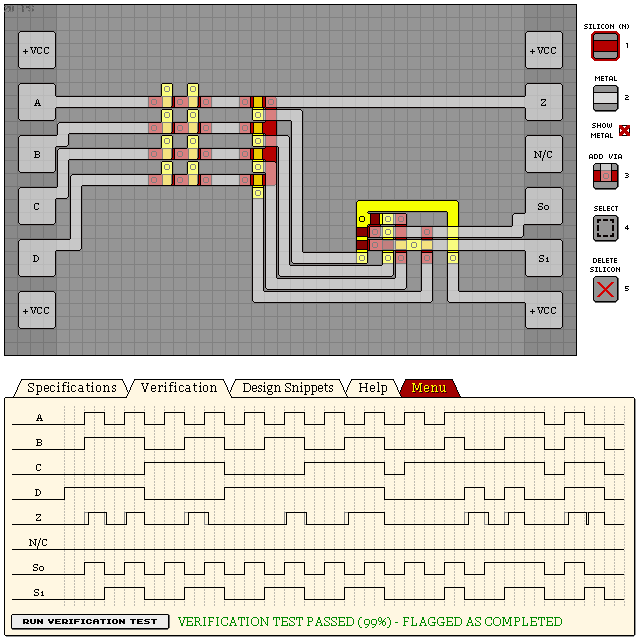
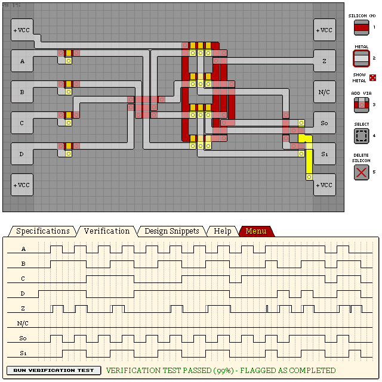

# KM141P - 4-TO-1 MULTIPLEXER

Essentially just a 2-4 line decoder with a simple input switch glued on top.

- Verification: Passed (99%)
- Design Score: 223

```
eNrtml2SgyAQhHXal5whV9j3Pcve/yKJAvFvaBWNW5YNsWLVNw0atJ2AzU/zfPzV
j9+6qUqqhBJKKKGEEt5UaO9aIKwHdaPQYr87eqy392ixbu4xfNvpPdY3vVa7dM7y
paMA3G0/DQWhtHujfsc4RLjUOWbRMW2qhMPe2dxmuL3+aECKKG/hfwKaqh+FdKO5
IbGRhZh5dQf90LB5nBNl7Yf9SN0p5K6EdIZGb3mfthtre1iG9H2YcXDwGSScZnOe
va7yX1FRUdGdFNc+I1mlqOhtaEoui7S2oAXV8mPOpZ1rtLJKUVHRAjOk2pFXbjVD
khm27SKfN4KbIfItI1ZZpaio6ElWCZr7gVolaL9BC9Zv1kiBS/zOskpR0btQTJYS
N2vB8lVuwsa1oCaMq1jlAQvnnwdabml88ujS0rioaAE1UJq3rAgXKFnnzmuXZiN7
LSYUM//45hr3IVbpb/tpP0fC51jI6wjKHERF19Klv+eFLVOL5tpk7/0dPn430Z0j
/bYjOeUFWYrItA==
```



## Traditional design

"Simplified" multiplexer design by ANDing selection bits and their compliments.
Includes input delays to help clean up output signal. Relatively inaccurate.

(99%):
- Verification: Passed (99%)
- Design Score: 346

```
eNrtml2WgyAMhSXXl65httD3WcvsfyOjUrRgEiyKRUSPetovkV+vAeyf/c/jzzx+
Td+l7M3xDEcTuSqOpF6PT7G1Y25H05t0R3MVx4Kbw4h71HHj01iCY2IZu3RH7gZN
AYpx/Lgdwwc64d1B855QRlq736Idp3CO5G2iANhjP7V8OL8dS7oT3kNhTdzh074b
/gpO3N2XHLLU/rgSHUpqt75jOTBXVlifb5tM+ZRtYlAaUqdTxxFvPZTJ9mivJWeb
FWZsyOXeK99CR3cS+VipjhNAPF/OrMmUK7isghiTpbsreKxrmx3RwOVlzz0iBrbQ
L0vOAEE/DDjZdgXJFrTFYOpW7o/sgiYJ6SalrZOqKn272qiOss17CG31fEt6Y6ls
tNFGS6EoPlypWiojcSOHq485/aH52hfp6ULzRZ64Mbn191A2Zc/3VR1CRIoq5Q6R
CFwVQ/YZJMaoSeUXpPKeA3BdKqHL3dli+K0h9jEDcLS48YO4sfiJjjZX2eYqr0q5
NapThFRNd8bE0tmivqhSLO+W1wqzzhhyXEAqdy6RU8YlcpWqQ2xEHkO66PJ4hGrl
3TbUheibujYeWTnPNy5AcPXvLK2FLx9lsJQwL/kTT6k+6mYcUikfcwYUBylSVqnk
j/1UUqxS4sbYzN4FqR/SrKIdoSa5QCqkmfK8UvFj+ob7KkqNZ+T5xhbb+y8dnPq1
QE5FErZ/UvTJmA==
```


