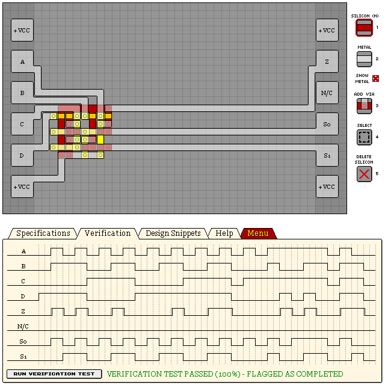
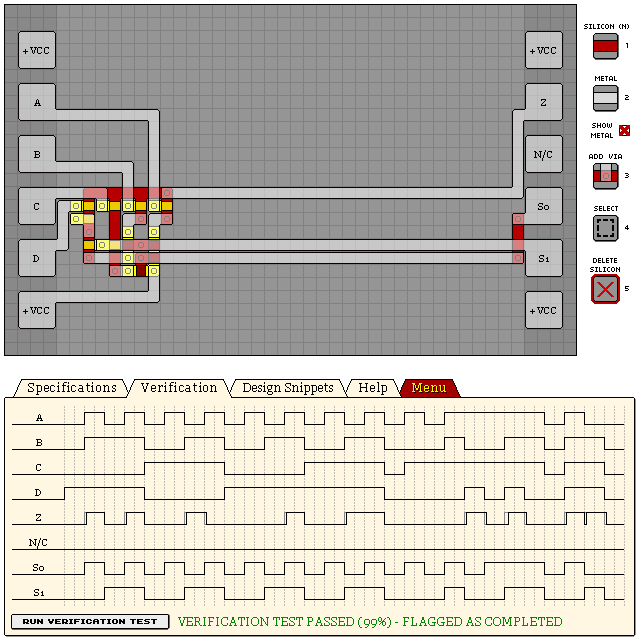

# KM141P - 4-TO-1 MULTIPLEXER

Essentially just a 2-4 line decoder with a simple input switch glued on top.

## 100%

[Open in Open-Konstruktor](https://openkonstruktor.natecousins.com/?level=12+KM141P+4-TO-1+MULTIPLEXER&design=eNrtmWGugjAQhMsOfzyDV3j%2FPYv3v4hRBFvcHW1B4pMpaWL8mO6alGHr9n%2F98XDuDqeuTy2XhAuEls0KYVdc2whtulKtMPnS91NNrak2RUy1EbXJJZRQQgkl%2FArhrZyzeNwoAHcup8PAMK6f7tPKrFDe4VAD0V6%2FH%2FUOnVAYN6YW0%2BmWeGUL6JCwwUJqoqK%2FT8enb04%2F7UieE75llaKioqL7pruwSrA32qMaDVbGi7igcY2uzLPSphUVlVVuaIaF9zxTZGfd55WzU7Ibl2gHOVk5zoofwLWlRUVllatbJagWX6nVphUVlVVuTIvOjGdZrPbLWG3dmEcNqlmalTatqOj%2FssoVetzTP3OsT0074Hmp5ve4OQ070bQDbkw7S82jcY%2Fb1OMWFeUU2alxXUf6mFX6czkt3IwfsfMSreUnj%2FrKipRRoPmdhQVaUdGdUGD%2BoGzjSM64AEU%2Bx%2B4%3D){:target="_blank"}

- Verification: Passed (100%)
- Design Score: 206

```
eNrtmWFywiAQhck+/niGXqH/e5be/yJNwSAJy9aASVUeTJzRbx9LHHxZxH/6j8v3
dPmavGvpFHYIJbt2CKdVP0coqbu9QqdL75+qa51qU0a3NyMXOYUUUkghhU8hDOWc
1FugANSrn4bmHWLzbo4PLyn1NSB8mEdtAyTyGWhcIv79PAyh04Q0CptKnaaQgt7u
SnS89MAhekj4AsOtlQGR1wKu7F8D5A15eN8VIAPyuNCtAaQJz2xxmJIfbG2qpd7l
uaSkpKRj0yGsEpWH2q1+hDEy/sgLM6+YI9uz4qIlJaVVnmiGK+8pKbJtcjlytstW
8xraKDdGrs+qunfnoiUlpVUeY5UwtXhKLRctKSmt8mS6OtrRLMuq/TK2t27Ms1aq
WXNWXLSkpK9llf0nSkj/zKVdp3LQbVHkpZp+SG7T6jG4eYQulnYzNY3WtKmurFek
pKSjU2S7xsc60mFWqV/9dOVm9hY7L9FabnnR76xILQo0P7PQoSUlHYQC2x/KOY6k
tB96BciA
```



## Best Design Score

[Open in Open-Konstruktor](https://openkonstruktor.natecousins.com/?level=12+KM141P+4-TO-1+MULTIPLEXER&design=eNrtmluywiAQRM10flyDW%2FD%2FruXufyMqxITo0CaDr4oNRWk81aCp0AyM%2FbE%2F7P%2B7%2FV%2FX7yJVwku1cw0Iu6KuFNowbsOI3foRbairR8yv9tYR9axKKKGEEv6kMLSwbuLmpHDO6iVRAG5rp7kgNSB9nq5cOl451C7d1rWWm0vTuyy%2Fp9fiUpt6v6XzckNHpQHlfZ5TExX9cTrNvjl9tSN5TrjIKkU5he6GqOjG6Vas8hr3hbT2QAuq5d%2B5vpI%2B1oqKisoqA2ZItZNXBsyQRIZl9O9owc0Q9Z5h0GMpKrqAFhNYVtlmlaCxH6hVgo6btaBnLCBaPfCioooqv4aOyZOolq1Z4CZsXAuTkYqKtkWV4dn9Zqt8Wo67jP%2FcPLUZyXFTWkTplRx3JAM%2BbbFr1O95yfZcWU5RUU5xf1j1whz3U6zSb%2B20tnSETjOCW2zWMxA7USz%2FYjT8KsUGoqKhefQxRyrLCZrsx9w%3D){:target="_blank"}

- Verification: Passed (99%)
- Design Score: 200

```
eNrtmluywiAQRM10flyDW/D/ruXufyMqxITo0CaDr4oNRWk81aCp0AyM/bE/7P+7
/V/X7yJVwku1cw0Iu6KuFNowbsOI3foRbairR8yv9tYR9axKKKGEEv6kMLSwbuLm
pHDO6iVRAG5rp7kgNSB9nq5cOl451C7d1rWWm0vTuyy/p9fiUpt6v6XzckNHpQHl
fZ5TExX9cTrNvjl9tSN5TrjIKkU5he6GqOjG6Vas8hr3hbT2QAuq5d+5vpI+1oqK
isoqA2ZItZNXBsyQRIZl9O9owc0Q9Z5h0GMpKrqAFhNYVtlmlaCxH6hVgo6btaBn
LCBaPfCioooqv4aOyZOolq1Z4CZsXAuTkYqKtkWV4dn9Zqt8Wo67jP/cPLUZyXFT
WkTplRx3JAM+bbFr1O95yfZcWU5RUU5xf1j1whz3U6zSb+20tnSETjOCW2zWMxA7
USz/YjT8KsUGoqKhefQxRyrLCZrsx9w=
```



## See Also

[Line Decoders](/snippets/line-decoders.md)
