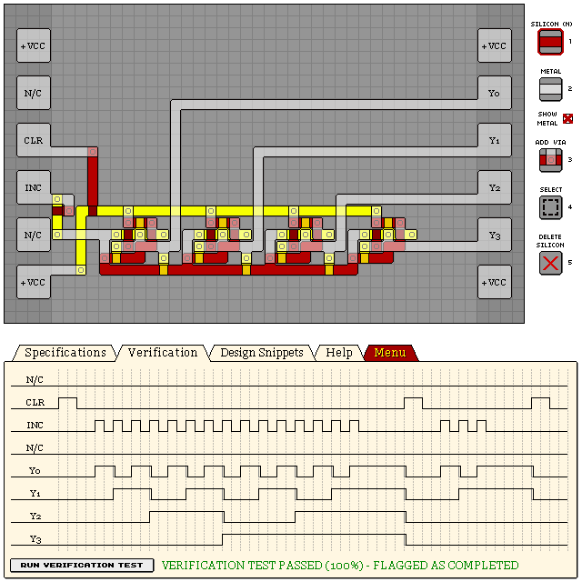

# KC84C - 4-BIT COUNTER WITH CLEAR


- Verification: Failed (65%)
- Design Score: 500

```
eNrtWlGSpDAINbz+mTPsFeZ/z7L3v8iWJioQwJjWbu1qra6a8YUEeYSQ4OP38efn
X/r5mx5Dz31DQU88VXeTIPGm+0fsEhz2CKY+QZpubpgmwbqpo0vLO9Jy7xTMt6LG
E0zir1TGcwUtpVL5kex8FUyOUqmytmNVcgTXsR1BrVT9tq5xZqW0A4Qj+r6atke0
BCtrtwkaPnvS7Njh5Fyp1Ovk6TknH3qdfOhzcstoZiTXSqXWJUArlfasHUqpj1nm
the5zhF3CyYdMq4r+BEOMKVz5F8TCsD8HYCyoVD+wzIuB8Hb7kQfgwNjulx4fAy7
7/wWKOj0QhzNjR/D3IxceH1vDo8iBaZKOneY4aVvKj6wmnKRL5ryBjT3MF/jo3GA
jOcHHIfA106LAUcbygbzC86eNlnCaSOsYTbIdszqoyIwWzCPQ7IBo7CYChaFC0dQ
HOWuF9dUFJXnlWwxGHcNrlUGCMzr5UsRCWYYuujJnFLICn01SmeikFMFVWDpQ1Ff
4n0FEy8IWX6obIqlV0BxSa2aUAQoAlnYPSOQRaAVNnRGPXinNfBl4SAWbujtH4ve
JlS+Hg2dFq0941it0C6LY22FQ+wMHGqrVo6+LHzRm4dKGBPF3qGfkXNi0y3h9Kye
uxlL2Ze6GQvMqeRmLKw7K9uRO6RaK+M8xM92oGXBzlAQB0NE2R38/A19HNksrN35
LOBEFtDAgpdzwvVYvC904LldIZ6SxTdU1glHD0pdKCIUO3qGjwIBCjLRZZKJCQ49
Dyt0PV2zdF66gw534BZ2UGmNAEUkixM4QsgCtligkAUKWTDzZCwnis4iizAYXjxv
RCcah7trBMP7bMDZQfexK1rfJgu14/LMoalnOBmLyL/ac051si5CB3h35hRGvH2L
zypzMeLZs0ps5Ng9HLkZGu7PwqUCKatgfjfgXu73iiL4ZoqOcGvQi8JHQV7xHWIa
wUftAniVxMnyeD0nVHVVJSaGziw/dBcdkK6u6pkK41OE1SYOGsu6WkX106D2Cs2C
rnGTW+OuPFJWwKvtrlvjNrWS23eE/lyx8J4aN/VWsVtQz6+weUSm9Dqxxn1IqLR/
z6MHnZN05pxildwjC7HEhplSj1bknZJZ+Up0KjiqWE9DGB84LZFbfMWiPhdRiUVf
BRzBUmhYspkjwOfonSzY0x8hCxfMsioajiqeVpeVzFwgIv0H8yDK2g==
```



