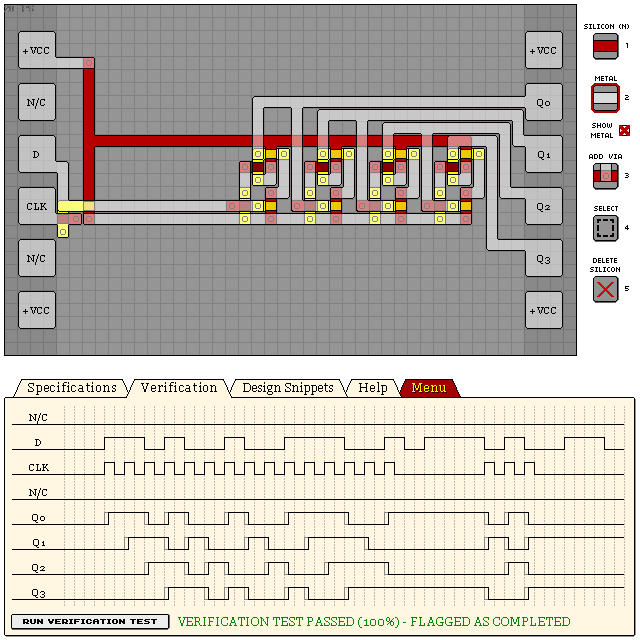

# KC74S - 4-BIT SHIFT REGISTER (S-TO-P)

- Verification: Passed (100%)
- Design Score: 312

```
eNrtmltywyAMRY2uf7KGbqH/XUv3v5G2fg+giwGT+iF7nMnkIHQtIo1i0n/2H69v
9/pyfVdy3spQhrPI0KU8OvXMkOpK79EMzZBPwQydnhvMcDaRXI9u8pqdHWLBseBY
cI4NTlcanGc1D+cxHNo50Y+BAohe9fSX993oCcPxJ0pk/GwesarB+J7g9dY2Q4TP
IJEZZJqCDFncqGO2MQxUJLBciQ5LF6MjgGKLaYioFDpdDjZzkSpQVahQhRpVoKpQ
oQo1qiBJv0FB8VQBkWTYIo0vzBvQsmBphXJXJTVq1KjRZ9NTlUqU28KW+C2UxBnM
Fk3XyFRdXZWVykyKvEKKY8qs0d2pBD3OHsy0NVV3V2Wl8sgkRdEXAHRmo5mUxJl1
HaBdB2Cqrq3qCcXwLqUyYrt9bmyd4TsoiTNSadhujUzV1VXdplRWboHHH3ao298a
relIjTalmF8JFVDKbalfYTvduipQVaCqkPYrbKebqAJVBaoKSb/CdrqZKr/lDKmo
NFjhyCrE6UpwYEVqWirjVz3d5iDseePJqZcRe5Ml9vvN72fYzPrfUbgqaaZKalRJ
M1VSo0qaqQoXMdCsx/n/KpJ3/ABKzMkh

```



## See Also

[D Flip-Flops](/snippets/d-flipflop.md)
