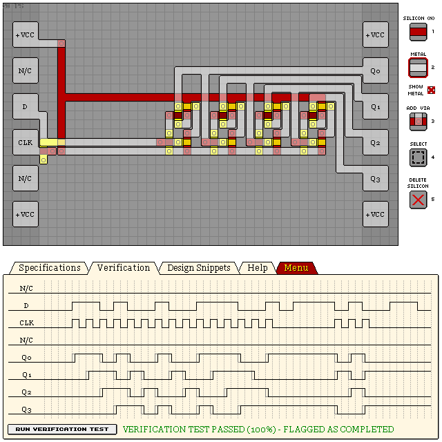

# KC74S - 4-BIT SHIFT REGISTER (S-TO-P)

[Open in Open-Konstruktor](https://openkonstruktor.natecousins.com/?level=14+KC74S+4-BIT+SHIFT+REGISTER+S-TO-P&design=eNrtmltygzAMRWNdfrKGbqH%2FXUv3v5F2XCiJbV3jV8JDZuDnIOtGRhqBM31OH%2Fdvd%2F9y063mOJWh%2BKPK0OU8OvUokOpqf6MZmiGfghk6PTeY4WIipR7d7LU4O8SCY8Gx4PQNzq02ONdqHvZj6Ns50YenAJJnO%2F3lsyP48ex3pf4GKaNitDN9XqIH%2Bgeg2GK%2BRVQKnf4PNnOVKlBVaFCFFlWgqtCgCi2qIFm%2FUd0IVK13JG0VujwiL6tIWiXcVCqNGjVq9Np0V6US9bawJX4JJXEGs8XQNTJVR1dlpbKQoqyQok%2BZNbo5laDHOYCFtqbq7KqsVPZMUlQ9AKAzGy2kJM6s6wDtOgBTdWxVVyiGZymVCdvUF2PrDEdSEmfk0nDcGpmqo6s6TanstMede4nO7HG3dKRGh1IsV0IFlHJb6lfYHreuClQVqCrk%2FQrb4yaqQFWBqkLWr7A9bqYqbDljKiqNVjixCmm6EnSsSENLZfpsp485CPveuHMaZMTWZEm9v4X9DJtZ%2FyMKVyXDVEmLKhmmSlpUyTBV8SJGmvU4v68iBeMHA4LI4w%3D%3D){:target="_blank"}

- Verification: Passed (100%)
- Design Score: 312

```
eNrtmltywyAMRY2uf7KGbqH/XUv3v5G2fg+giwGT+iF7nMnkIHQtIo1i0n/2H69v
9/pyfVdy3spQhrPI0KU8OvXMkOpK79EMzZBPwQydnhvMcDaRXI9u8pqdHWLBseBY
cI4NTlcanGc1D+cxHNo50Y+BAohe9fSX993oCcPxJ0pk/GwesarB+J7g9dY2Q4TP
IJEZZJqCDFncqGO2MQxUJLBciQ5LF6MjgGKLaYioFDpdDjZzkSpQVahQhRpVoKpQ
oQo1qiBJv0FB8VQBkWTYIo0vzBvQsmBphXJXJTVq1KjRZ9NTlUqU28KW+C2UxBnM
Fk3XyFRdXZWVykyKvEKKY8qs0d2pBD3OHsy0NVV3V2Wl8sgkRdEXAHRmo5mUxJl1
HaBdB2Cqrq3qCcXwLqUyYrt9bmyd4TsoiTNSadhujUzV1VXdplRWboHHH3ao298a
relIjTalmF8JFVDKbalfYTvduipQVaCqkPYrbKebqAJVBaoKSb/CdrqZKr/lDKmo
NFjhyCrE6UpwYEVqWirjVz3d5iDseePJqZcRe5Ml9vvN72fYzPrfUbgqaaZKalRJ
M1VSo0qaqQoXMdCsx/n/KpJ3/ABKzMkh
```



## See Also

[D Flip-Flops](/snippets/d-flipflop.md)
