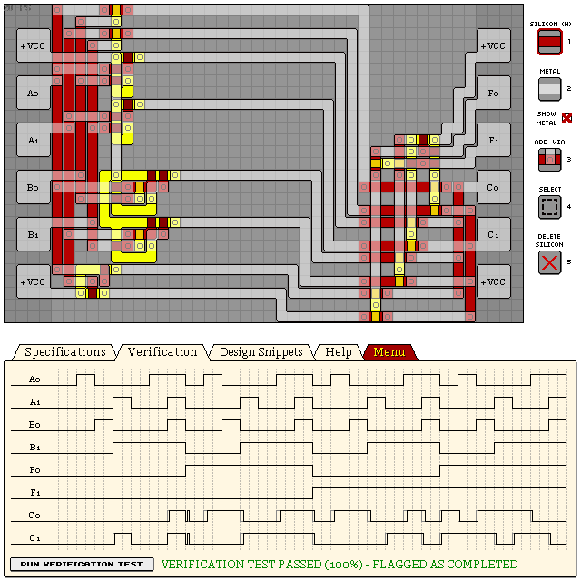

# KA181 - 2-BIT LOGICAL FUNCTION UNIT

- Verification: Passed (100%)
- Design Score: 615

```
eNrtWVtiozAMBA0/PcNeYf97lt7/Ipv4KQnJGGjawBoammQ0srGNMrKWv8ufj6/5
43NepiPnxYj7TtXibmpfi7WLFM5CpO62KFgX4uSSaXUyYrzHKfmbExwNOGHO3bSm
I9/RbLhitO15pNLdE8RdK4dKl6e9xHs8HT48lxmV1waxrk59pTYxjufuFmezRbEI
bCKx1VIfu6mHWA1XlL4WaZmPT8ch4maU203+X347BnEQL0EMco78I6AAzNdZ9HFd
pueHZaLHe3p+Hf4/vk23hfAhg9EivIpB8Pd08MSTeypNBP8Jj62UPlDuQ3KWr0C1
ihYIXSoW8W20IWaTOl/66qG0yQW5aOguCvroCSkoDpiB54OgnUuIofKQqIbi+CA2
KVaVdEQahbCUqGzDRYl1THuW3VbcBlqhA2hckHkqMxwfumJBafyJmEX2QA6c+Q5e
G6Bj/n8Rzmd6IJ/BgZBoxSxPecMiWXkWrwpnrTDaFWevh8KBynDZGPOcI3pHu3BR
0Go1SVobveosrCNeJzc/fAYKe6yw6RnC5parfaA/gd40VO5H4YY7jMXTg+Jl3BOe
gTFHA71BqIRczdDqDnq9ZyEWkkdOqtIh6RlotzmVKhn7+mkC05yoewmUcm1xRypP
97XQBnpCkf7C4vEzVine0Ap362yX+OytdGPZvzA1p5cLVs84rjnB/vw5Egn6CCwj
VF4ixVY7eG5iKDZN81acmYCX/TA7ZKWtjgZ6pwS8ESoJvWjbsxHu6jamFUixGe5G
Aj7Qy6tK8xCbtzacdOOKpSo9KwtUvcqrGSwa5j4jqxiYCbgIcxvKEG4wxI32KkVl
B7u4dYgB1zPz379XCfFjdeCnYb0mXXwElhEqz1aUwGu/JR3OyhCsvFsUXlGGNb9l
Ki+HSl564Z9iu2CqsRS7eeKvUbIV6XYpnNxiNw+XZil8g0vrSrfwbKFC0doaW1fJ
DSmMvaUZ9AdSq9zso5V7qES+gbaL4GTVwJXnRvAfaBtFcwsFbG9Go6+pcX9LqLRf
59G3SCpJ75F+a7tNzdnmAq4iBbzUXqhsub8KjVnqvaX8m/drKP/usVINWOjBWVCd
HkrpjVBjTSku8DYR6R8OAMvv
```



