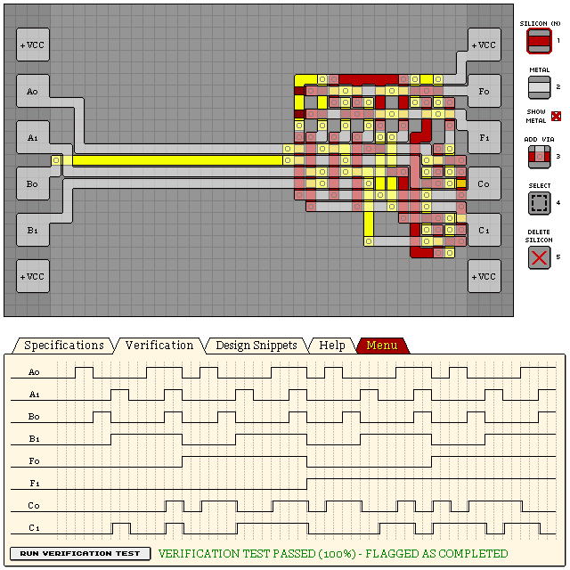

# KA181 - 2-BIT LOGICAL FUNCTION UNIT

<a href="https://openkonstruktor.natecousins.com/?level=16+KA181+2-BIT+LOGICAL+FUNCTION+UNIT&design=eNrtmVti4yAMRW3d%2FHQN3cL8z1pm%2FxtpayOQQOJhN23sIc6rPVyEDVYk9PjzeH%2F7t779XR%2FLkeNiwrEjszgs7bOYhkjbEYXUbYu21lG4uGIqDiHcz3EJ%2Fa0B7w2kYOVhWtPBZ7QaXQlZex4pDveEcGjlUBzyMiq8x93h4zXOqH6vCNPqzN%2BpLtyv57DF1bSoFoEtJLFa0m239AhTw0LSZ5Ee6%2FHpOCRserlh8f%2Fy2zGFU3gJ4RbOkf%2FYKADzdZZ%2Bvu%2Ffaf8WPokpCAx2CkpaIP6PrST69SUqtg9uEexC9IfUgu2S0m5UjIoHHMfmUWpqQS7lsVkUAVmUHyXVSFD90NRETNNC0b1QTqFaaqoNuJRsu2DrBlVCi5J%2FRm0a5jY8S0rhuhNNalKxWiwaWlj0WR6p5gm7XOX1KBwUL5fNRM%2FJDTftwqUge%2FGQ8qcuveoslA6tU8t3hEG927DZM1SbW672SX%2BC3tRVjlO47g5z8fRQPE17omdgztGkN3CV0KsZeXSHfL1zILYlhlKUQoeUgOtuOVWKCXh5N0HEnCkBp5hoyTPKEnA%2FFmrQExHpLyyeegKuh%2Be6uzKZJTl7ZfpGMQeD5wz9mBP1a1WPOSGe%2FhyVCfh0LNNVvnqKne3OuYmh2v3knTYzAY%2FbXbbLClsdFXqnBLziKgm9tN6z4e7SLqW9D9ZydzMBn%2FTyUaX5UJu3No6Fm0yVFW6KFkjxqqxUCG%2FIYwZHMTATcOXmGpEhXGeIG%2B1VqsINhrTpEgNuz6L%2F%2Fr1KqB%2BrAz8N5Zp0%2BXQs01WerShBFnVjOpwq4EStCngW5bGrlKUX%2BdduN6uAyyRaFKcFJTsibde4ya1iS3dp1rgbWiJUe7aoimjtGDuvgBuhMEZLM%2Bh3pE692KFJe6gC3qCzxv2LFNUtFIi9me%2BsgD%2FZVdqv8%2FQlkkrK90i%2F1W415qxrATciBbzUXkXZen8VObOi91rkXz1fI%2FLvvlaZAYsenIVs0DNSeiFqrKlMC7yMR%2FoAHkXLdQ%3D%3D" target="_blank">View in Open-Konstruktor</a>

- Verification: Passed (100%)
- Design Score: 615

```
eNrtWVtiozAMBA0/PcNeYf97lt7/Ipv4KQnJGGjawBoammQ0srGNMrKWv8ufj6/5
43NepiPnxYj7TtXibmpfi7WLFM5CpO62KFgX4uSSaXUyYrzHKfmbExwNOGHO3bSm
I9/RbLhitO15pNLdE8RdK4dKl6e9xHs8HT48lxmV1waxrk59pTYxjufuFmezRbEI
bCKx1VIfu6mHWA1XlL4WaZmPT8ch4maU203+X347BnEQL0EMco78I6AAzNdZ9HFd
pueHZaLHe3p+Hf4/vk23hfAhg9EivIpB8Pd08MSTeypNBP8Jj62UPlDuQ3KWr0C1
ihYIXSoW8W20IWaTOl/66qG0yQW5aOguCvroCSkoDpiB54OgnUuIofKQqIbi+CA2
KVaVdEQahbCUqGzDRYl1THuW3VbcBlqhA2hckHkqMxwfumJBafyJmEX2QA6c+Q5e
G6Bj/n8Rzmd6IJ/BgZBoxSxPecMiWXkWrwpnrTDaFWevh8KBynDZGPOcI3pHu3BR
0Go1SVobveosrCNeJzc/fAYKe6yw6RnC5parfaA/gd40VO5H4YY7jMXTg+Jl3BOe
gTFHA71BqIRczdDqDnq9ZyEWkkdOqtIh6RlotzmVKhn7+mkC05yoewmUcm1xRypP
97XQBnpCkf7C4vEzVine0Ap362yX+OytdGPZvzA1p5cLVs84rjnB/vw5Egn6CCwj
VF4ixVY7eG5iKDZN81acmYCX/TA7ZKWtjgZ6pwS8ESoJvWjbsxHu6jamFUixGe5G
Aj7Qy6tK8xCbtzacdOOKpSo9KwtUvcqrGSwa5j4jqxiYCbgIcxvKEG4wxI32KkVl
B7u4dYgB1zPz379XCfFjdeCnYb0mXXwElhEqz1aUwGu/JR3OyhCsvFsUXlGGNb9l
Ki+HSl564Z9iu2CqsRS7eeKvUbIV6XYpnNxiNw+XZil8g0vrSrfwbKFC0doaW1fJ
DSmMvaUZ9AdSq9zso5V7qES+gbaL4GTVwJXnRvAfaBtFcwsFbG9Go6+pcX9LqLRf
59G3SCpJ75F+a7tNzdnmAq4iBbzUXqhsub8KjVnqvaX8m/drKP/usVINWOjBWVCd
HkrpjVBjTSku8DYR6R8OAMvv
```



## See Also

[Line Decoders](/snippets/line-decoders.md)

[Logic Gates](/snippets/logic-gates.md)
