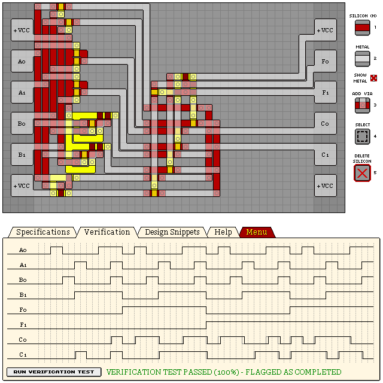

# KA181 - 2-BIT LOGICAL FUNCTION UNIT

- Verification: Passed (100%)
- Design Score: 690

```
eNrtWVmimzAMDBp+3hl6hf73LL3/RcriRbIkx4bmkfAMCUuGsRwsBsmaf8+/vv5O
X3+m+XFk/TBi31pY7KbuxEYry0rbKv5jmy1atpT/42POHeb7aCFY0cT9tFwlUTYg
LGb6xIhTOJuiLT2OVOwfTmNNDnCKyPcdRN39T3w6BnEQ70GckuqJbY2Y1bTc0vzk
/UhHLE6mRZLvDttaVLdMyZpfJeYLBaXdopLGnuE4RDTfl22eY5B/xNOxhXPkLxsK
wPyeRZft/FhP5gctx7T+vO2XX8PfwnYSwf2K7ZsuiO2tcGidsoV9CWxK9slBifVu
sUsQyw5T7DxyfzKZoVuHw33cjx20zg2HNgrW9negYaS+33A3CvjoerNtNAy0gSao
QKWHcNSAEooK6kA7yh9O2Q6VKMSVEpUGXJRsu4jWDVQQS1RCAkVJzKjsKsXPS7Wp
polNonkftHZDELggPGmZq2HVLr9QoaKVTvTOYzTQHn/GMe7u5Caa/L8QwwZvx51H
4YdJZTMqA0fbeca9GugVKF7GPdEycPdRuFQqIe8xZHQnMlUZaq0oSGS6KONGyNGP
MbyRRfPR3luGTNBUzKkycC/mrMtsFT0RkQ5h+Xi0noDzk4rc6TRZ+7P0/5hjWzFn
SsCdmFP0qzfmBPtY96pIwEdUeRrFkxTbmnDkXzYPFmZC08SRKYZxqsMRtDo6EvCB
HpBKQitab9mQu8g1xTDOGY4E/Iqo0lwy14W32M9gpdINGWQWkRaCBpRxY5rqZUdc
KqXXHJ2rhPeOHlI50KZUV5d1qtzkyAS4LcP2WDxtGTjxamBPqRlVemWsN5PKcxUl
kIrdUnSXw3pWCedVzkRhVfAos6wGTqkGTrUqd5LZ0t+SIWsQdQlcSZpXAtfRbGuR
u859+0r0RSiRXwGPCalGkwd5o6Aq4Cp3SKgTwsXpJoPYW5pBu5AadeoKmrmHKuA+
GkJVswLOYwaZYoM/IsVU1Wtq3P9FKu3vefS9kncWNxbRasG1S+D9SVYl5hxx1BG0
FnX4XieyFSuYUXZ1PqM9R3iPlSXVMqzq/xXXdd4rnbuZd+LAKIhOF1LpcvMElUIh
5q8uV6R/f7DMLg==
```



