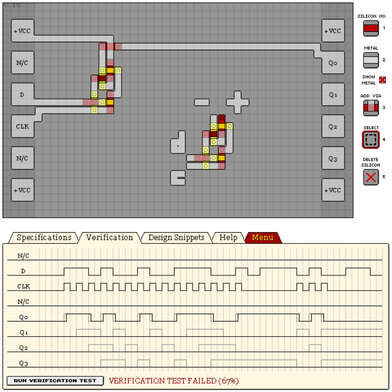
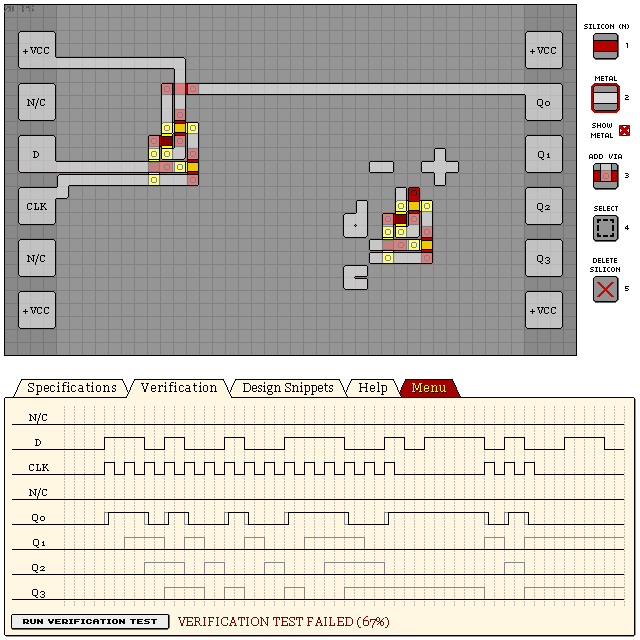

# D Flip-Flops

## D Flip-Flop

Design score: 45

```
eNrtmlGWgyAMRUeeP13DbGH+u5bZ/0bGgiJKEimWjton7Wk9lyeYYBpN+5/++/bb
3e5d/1XTKKSQQgovJXRj654TTqJHc+XCbtWKhW7V6MfjCxNPvXXEZDGXCYXFXCIU
F3OJUFzMXDk1Qp/OOX3zFID43k/9NuwiTAfZ0LEDvEimfgVIEyc/FH94cPKiwmHx
4buD2+LhCAqPC0nkQa7xMDj8S+Dj1PX5p1i1H1r7J34v7zFfoLFT3me4esceRqfg
nkWHsJMO5UebcdZp8lJyzisevLTgfmfZQTrpd8Q7Mc4WBWJS0jNQ0Br/RPEB58tQ
SXoailqtlOpKh6adFYpaLSTpQguGSlLSV1OoeWO4a4dMEa5YlcaPC1sS9eFutrwY
DKPlBZpYXqRisGSoJCXdQzFd7lreCDBvbBZmYeWNwCXyRoZK0muESmzdgGuhMtSB
LApc/TknsEe7lZFqoTKxvEKBszznbF5fT42pFcgFcy+Kf8ZJkR6JqgX0oiMrxXMj
b0yOjDxURqqVxedVp825YE3iFD6ynxluUyOgwQqVs+V16p6nbWrcLwmV8ns/VX+0
0kfK+U8Ps6xjUoihI3vY2GRWsCvgqLkB1/79dj4foeG4sCvgaHAD3jgiSdsfuM3I
lQ==
```



## Mini Variant

Smaller, less accurate.

Design score: 30

```
eNrtmlGSwiAQRIXmxzPsFfZ/z+L9L6JF1hQkMwORhA3ZjpWy9NkDZrCdEcN3+Lo/
3P3HhdsnNwop3Ffogo+3auH0aBK5LSO6eLp477cKJ8lbzjxSSOEBQtENykLFDUpC
1Q1qRhTdgHmksLcwlnNePyIFIJ7t9PVJwO9I8cnFwBn2nbFvp4BCX0PPF0LAbyjS
ad7xFTpWMjnjcPtbbk9vrd727jpgYE69gGFg5MtGwknq18GzdSNPzQqeLpwFNhdc
suRPmpKOtqXaZZWfkpKSkv5vSqs8jMKgsLRoicwsjENhUFhatERmFmiVp6JqEx07
pWVvn2rhoZohJMwsDEmFbjn1Ouh2ly0BUWtEZhZolSezStvuVC2kF/A6X9Eqbbsr
VJWsG2mVV6FG3bhieVWJhsjMwjgUllVaDTjQEJlZONIq23aUINdZu+1FD0m1HUmp
qshrTm9WpKQ7U2G/u0qrbIZnWpPC1npY49qzGj9Hx+xx72KV8tlOy+YwbgOuLgCh
bEz/S1Ta9AG//bu2yXM+NtZ+NZH1XyM/1xqzukw/0sWR8uMJ7+DHqw==
```




## See Also

[14 KC74S 4-BIT SHIFT REGISTER S-TO-P](/levels/14%20KC74S%204-BIT%20SHIFT%20REGISTER%20S-TO-P.md)