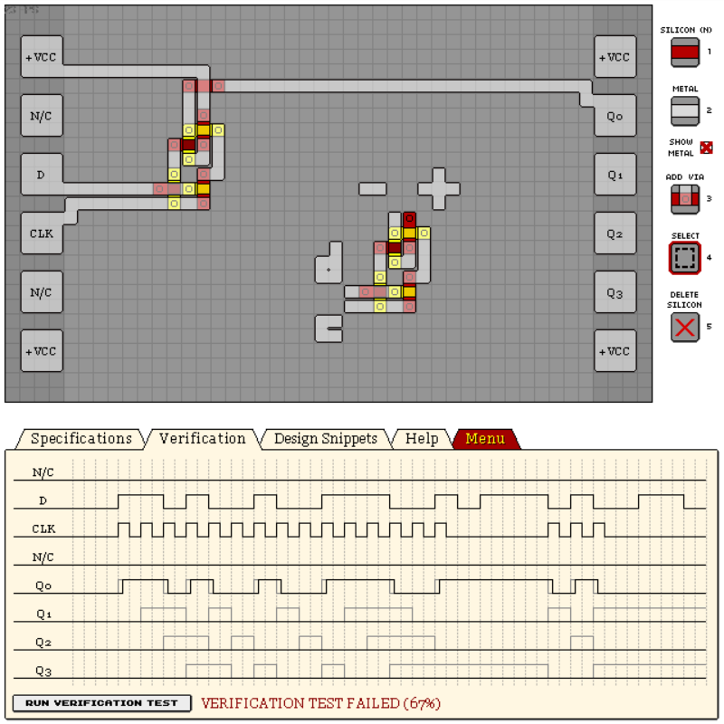
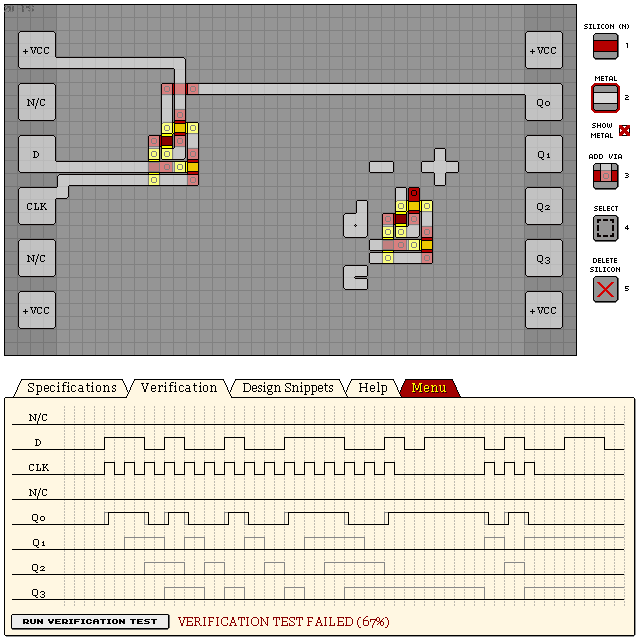

# D Flip-Flops

[Open in Open-Konstruktor](https://openkonstruktor.natecousins.com/?level=14+KC74S+4-BIT+SHIFT+REGISTER+S-TO-P&design=eNrtmlFygzAMRIuWn5yhV%2Bh%2FztL7X6QDBuIaSbhmHLC7eBLCvKwhshCylfFr%2FHx8D4%2FnMH6UNAoppJDCroSytOFvwlU0NckXDknLFkrSOI73F0Yj9dYzRs6cJ1ScOUeoOnOOUHVmek6JcE7nxN5mCkB9nafzhvlYsDvvRpdvqNS4ZtIL6LRfP6sUNp0cAOLTcKTSzUkUGqQ6DSdFcL%2BULpdrXXMMDVvhJmOU3kEJFYhP9%2Bq4533nC40sr9LN8ja9IiKpkTArVJKStkBBa1xE8Q9%2BL0MlaTMUpVotX9W6pp0NilKtn6%2FqXTNUkpKepDDzxjAJhE4R7liTbruOLYnycKdP7n9NwMWbgLtTbDEpQyUpaRHFertbeSPAvLFamIWXNwJd5I0MlaR9hEocTcCtUBkKCx4Fel%2FnBM5ojzJSK1RGljco0Mo6Z%2FUKeGxMq4qtmJvV5BapXwE%2F6vlMBfzlX2oF3KxxS%2FxuUdcaaGKMjmvcPnUCGrxQKaU17noV8MqhUn%2Bdp%2BZDK15S3j96mGXdk0INHbvFxipXBb8CjpIJuPUXtfbGCBXPC78CjgoT8MoRSdt%2BAGQnx9k%3D)

Design score: 45

```
eNrtmlGWgyAMRUeeP13DbGH+u5bZ/0bGgiJKEimWjton7Wk9lyeYYBpN+5/++/bb
3e5d/1XTKKSQQgovJXRj654TTqJHc+XCbtWKhW7V6MfjCxNPvXXEZDGXCYXFXCIU
F3OJUFzMXDk1Qp/OOX3zFID43k/9NuwiTAfZ0LEDvEimfgVIEyc/FH94cPKiwmHx
4buD2+LhCAqPC0nkQa7xMDj8S+Dj1PX5p1i1H1r7J34v7zFfoLFT3me4esceRqfg
nkWHsJMO5UebcdZp8lJyzisevLTgfmfZQTrpd8Q7Mc4WBWJS0jNQ0Br/RPEB58tQ
SXoailqtlOpKh6adFYpaLSTpQguGSlLSV1OoeWO4a4dMEa5YlcaPC1sS9eFutrwY
DKPlBZpYXqRisGSoJCXdQzFd7lreCDBvbBZmYeWNwCXyRoZK0muESmzdgGuhMtSB
LApc/TknsEe7lZFqoTKxvEKBszznbF5fT42pFcgFcy+Kf8ZJkR6JqgX0oiMrxXMj
b0yOjDxURqqVxedVp825YE3iFD6ynxluUyOgwQqVs+V16p6nbWrcLwmV8ns/VX+0
0kfK+U8Ps6xjUoihI3vY2GRWsCvgqLkB1/79dj4foeG4sCvgaHAD3jgiSdsfuM3I
lQ==
```



## Mini Variant

[Open in Open-Konstruktor](https://openkonstruktor.natecousins.com/?level=14+KC74S+4-BIT+SHIFT+REGISTER+S-TO-P&design=eNrtmlFugzAQRGsPPzlDr9D%2FnqX3v0gr0yA77I4BB4LJEKEoeZk1Yq3JbjbD1%2FB5%2Bwm37zB8bHlIKOFzhWGI6bFYOL4aRWHNiiGdIT3HtcJRcpcrjxJKuIPQdIO60HGDmtB1gyUrmm6gPEp4tDCVc9E%2FEgVgnu30j%2F8vlN57WDensTMKeBTTLTDoHZo0xU4fcKmTQdGtFJjyPKfwKcodYtAsy7PIxQ4xr4pEzndISdm%2Bmt%2BTE%2BdoT0fynHCRVYqKioq%2BN5VV7kZBKJgWLZGVhX4oCAXToiWysiCrPBWlbTIee%2FdciwjWCs2xstAltdrkzOvg212xBUwtiawsyCpPZpXc7tjvM1Dd%2BBZWye2uUlWqbpRVXoWSunHGyqoSDZGVhX4omFWyBhxoiKws7GmVT5pxx2vNuJuoO4s0qgpNol9I6QScaPkEPNYpuDaCrcuvqv8c7TPjfopV2mc7rZtDvw24uwGMsjH%2Fs1Bt6AN9%2Bx%2FaJk%2F5WFn7LYns%2Fxq5XUuu6jL9yCGOVB6%2FpFTHYQ%3D%3D){:target="_blank"}

Smaller, less accurate.

Design score: 30

```
eNrtmlGSwiAQRIXmxzPsFfZ/z+L9L6JF1hQkMwORhA3ZjpWy9NkDZrCdEcN3+Lo/
3P3HhdsnNwop3Ffogo+3auH0aBK5LSO6eLp477cKJ8lbzjxSSOEBQtENykLFDUpC
1Q1qRhTdgHmksLcwlnNePyIFIJ7t9PVJwO9I8cnFwBn2nbFvp4BCX0PPF0LAbyjS
ad7xFTpWMjnjcPtbbk9vrd727jpgYE69gGFg5MtGwknq18GzdSNPzQqeLpwFNhdc
suRPmpKOtqXaZZWfkpKSkv5vSqs8jMKgsLRoicwsjENhUFhatERmFmiVp6JqEx07
pWVvn2rhoZohJMwsDEmFbjn1Ouh2ly0BUWtEZhZolSezStvuVC2kF/A6X9Eqbbsr
VJWsG2mVV6FG3bhieVWJhsjMwjgUllVaDTjQEJlZONIq23aUINdZu+1FD0m1HUmp
qshrTm9WpKQ7U2G/u0qrbIZnWpPC1npY49qzGj9Hx+xx72KV8tlOy+YwbgOuLgCh
bEz/S1Ta9AG//bu2yXM+NtZ+NZH1XyM/1xqzukw/0sWR8uMJ7+DHqw==
```



## See Also

[14 KC74S 4-BIT SHIFT REGISTER S-TO-P](/levels/14%20KC74S%204-BIT%20SHIFT%20REGISTER%20S-TO-P.md)
