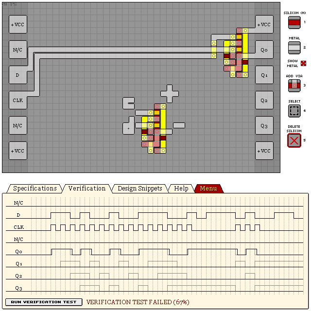

# D Flip-Flops

## Edge-triggered D Flip-Flop

```
eNrtmlGSgyAQRJdpf3KGvcL+5yy5/0V2hbiKMAOKmFhpLZOUzwYzAy0UDj/D9+3h
bnc3fO3ZKaRQhW67cDwnfq8Uht+TROprdP5w0femGtkAKDxO6LYLs32lLFT6Skmo
9pWaGtkAKKTwJKEfzom+eQoge7TTv96OZ03+5KriCMvJWJopAIV6ANFpiFNIkkj4
XFwylu8vm1OZv2jUZnP6/nj6888Yh1jl9FDw/zaFeUVRpIsEJiVHCczUGzKslLxs
GDFVWszqnhUqH0PxCrNSTbLKRUlJSUk/m9Iqu1HoFJYWtpZxPp5Cp7C0sLWMM62S
tGyGEHWSlcKFFiUts3C0GSaT6CxMKUpaZoFWSbp73Ahz3EgzvNK4kWZIq2S4mil0
I4U1AZ+XLxjJkygMM7SMNEoVI0mrbF1RwmK6kt5Y5/XpN6XJ4HFls/qI1Ejx1Wlp
jdsuedcKuJTpnKqsVlnjLqxic427ggo6OVJXq8wf7VS1h6s/ldKB4/wKBHRteCXG
Khl6yVd/gs+T3dw0Gb3qtUpGSWtO3tWSOWuooXixI8XbL/Uwx58=
```



## See Also

[14 KC74S 4-BIT SHIFT REGISTER S-TO-P](/levels/14%20KC74S%204-BIT%20SHIFT%20REGISTER%20S-TO-P.md)