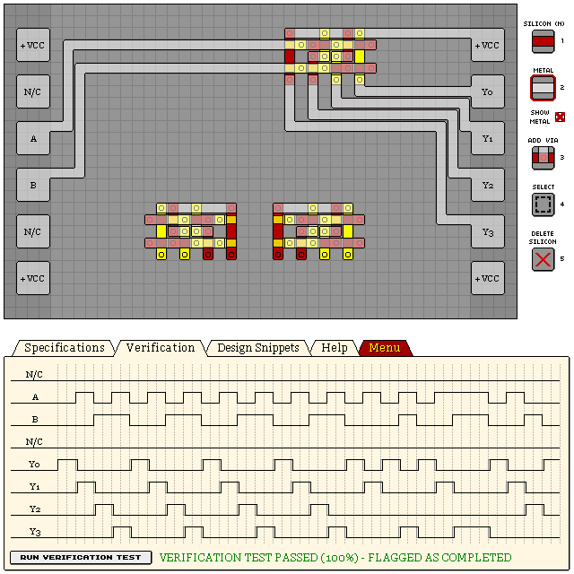
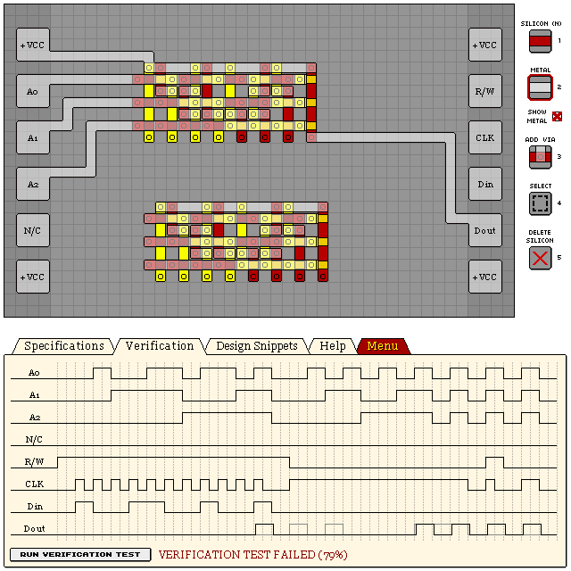

# Line Decoders

## 2-to-4 Line Decoder

Design score: 55

```
eNrtml12hCAMhYXry6yhW+h719L9b6Sn1hkhhIBEHLTR48PM5zU/QmTMzJ/zx+Pb
Pb7cPLXsJjThoEK3HjuF/rXvFLp1b3C10WIi25Mc4my9q1OLRddu8TJDTojRcaOj
LqsJqr2PkkVh5DCodqxKUmF2lFKTtegLzgoVIEFWV014E+GynPP5baEA2ENPl9m4
GMJ6xJZ/T122DJ0nIDiFwfmohsJ4hsdilDBOxF70LKY0ai/m5DAKOn59OESIz8+P
YOMlw4uhf1ds1UpehcOa8ZkO+o3G1kajdMKmNLyFyZUZ2q8+ZetiVeE0atSo0f9N
rVQOTMn6LaHylXtpNT6flit5RVqKF0KucJxW57NRK5VWDD15Q8FTiMUQnbQan/tl
ktilr2/kokTiRYRJrraPaq3KZ5tHViqtVN5YO+aq8opao1YqjW4LFmnth8KP6F5a
jc+n5YrrNNTHC+RzlVy3Xavz2eiIpfKIjlKmoy1TMG99ap/Cl6ByN7lA8R7tkJlk
OuDB17s74D7scXPa5h53QO/U4xYp/+YWwcMk1wHfCA6vSJ1KJX/oacFt5k9BUVDs
34bsaWg0N4N3aBV2FT7f8h4lszSk4vzN3cE3VKQfNV7JDA==
```



## 3-to-8 Line Decoder

Design score: 164

```
eNrtmltygzAMRUGXn6yhW+h/19L9b6SUUJCsh+1AQmeiMskkOb6yZIOwUafP6eP2
Pd6+xml45EhhCs8RjuzVISRxhAalcFyPskfDYOmq3aNhUMe4NwoNtsdYGLRjHB+J
cQhidHv0HDUM2idA6axh0J+OITboD07FoB3j4E6G06M3IYZBezoGI8bx0RiHuEf7
aIgxs1wKU3ihcFnOkf+3UADm6zid+TRgySvzh/mb6nttsUgCvPwSYOBuwcNm3H34
1/8K50PPWkE02r78zQzuDe4YEWafOUUzRUGpmdKpFM0UBqVmSsqrgPJ3NQuk2niU
krZQQFyzZprCy9KUlx6b8mfSpEmTvjfNVPlyGq1d5Q3YWs/sWusuXKpLyyjv0sIr
zvQ6CqUHppY6tRRqaz5T6HM8VhSOVTRHVJmjPNszVSY9ngzFxk1vsYltG7f33TLY
71AXOGjbxmwtuWW25ySoLSd2p9aWPCL+6MPX7i3btNLnUlvzmY+V9jkeK55I9VhF
c0TmNjyvhUyVSc9dN8ZrktT+f22e7Zkqc0CeT6HKTpKya1SVKtYSRNGSU6kuLe8c
0F5xBpUcRMHI1RL1aaXPar1a8Vnq+sZK9uqXk+L5teYoz/b3TZUHC9/bcySzLl2l
Qcm7gboV7YuoqL1SpcZNfXXbopoca+M6daSlU7VHfD4wVjI9Z437Qtr0PBknZqSn
pkr7dZy2uK1v7z0hq+XBxfcs5D06aVLjn4V6tBdkpB8UUcoT
```



*I don't really have a good way of demoing the full use of this line decoder in the snippet
design, but you can see it utilized for
[15 KR8S1 8-BIT ADDRESSABLE SRAM](/levels/15%20KR8S1%208-BIT%20ADDRESSABLE%20SRAM.md).*

## See Also

[09 KD124 2-TO-4 LINE DECODER](/levels/09%20KD124%202-TO-4%20LINE%20DECODER.md)

[15 KR8S1 8-BIT ADDRESSABLE SRAM](/levels/15%20KR8S1%208-BIT%20ADDRESSABLE%20SRAM.md)
