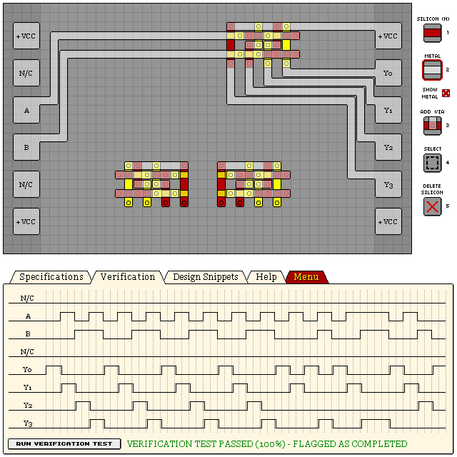
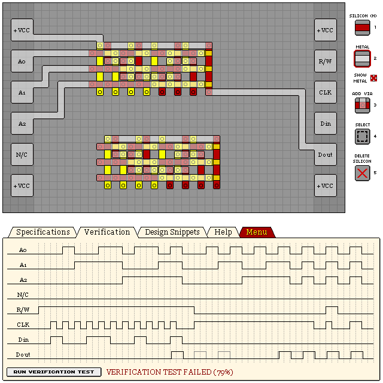

# Line Decoders

## 2-to-4 Line Decoder

<a href="https://openkonstruktor.natecousins.com/?level=09+KD124+2-TO-4+LINE+DECODER&design=eNrtml2WgjAMhW3Di2uYLfg%2Ba5n9b8Qjg1DSNP2JlYoXDg%2F4eUka0lCJ0236uf6566%2BbLi07hBAOKnTLUSn0614pdMve4GqjxUhWExzmbLmrlxaLrt3ix6ScMkYnZUdZVCNUeh81i0rmCKg0VzWpMjtyoUla9BlnlQoQIdRVCE8inJdzPr3NlIjEw06fGy3H3u7ji%2FOWoCsnmaZHNApdTyVKGUoHUdWrgyJJPGN9mBfM5%2BcpieNlOSXQ%2Fyu2ajWvwlwWfOaZvtG9tdEon6UxDW9hdGWBdq9IcdYVlUpQUFDQ76YolQNTtn6LqH7lXlqLz2%2BLlb4izY2XlFjR67Q2n0FRKlEM%2BVsJmZJaDKmT1uJzv0gyu%2FyVjV6U2Hhph1mstlOz1uQz5hFKJUrlibVjrio%2FUQuKUgm6LVi0tR9lfkT30lp8fluspE5D%2BXiJ0rGKrtuutfkMOmKp7Njj1ikJb31Kn8Lf3gH3J%2Btx61TogAcfV3fAfdjjlrTNPe6AnqnHrVL5zS0FD5NUB3wj9PKK1KlUyoedZtwW%2Fgm0G5T4XyE8DUFTM7hCa7Br8PmU9yiapSFV52%2FqDh5Qke7OZMjw" target="_blank">View in Open-Konstruktor</a>

Design score: 55

```
eNrtml12hCAMhYXry6yhW+h719L9b6Sn1hkhhIBEHLTR48PM5zU/QmTMzJ/zx+Pb
Pb7cPLXsJjThoEK3HjuF/rXvFLp1b3C10WIi25Mc4my9q1OLRddu8TJDTojRcaOj
LqsJqr2PkkVh5DCodqxKUmF2lFKTtegLzgoVIEFWV014E+GynPP5baEA2ENPl9m4
GMJ6xJZ/T122DJ0nIDiFwfmohsJ4hsdilDBOxF70LKY0ai/m5DAKOn59OESIz8+P
YOMlw4uhf1ds1UpehcOa8ZkO+o3G1kajdMKmNLyFyZUZ2q8+ZetiVeE0atSo0f9N
rVQOTMn6LaHylXtpNT6flit5RVqKF0KucJxW57NRK5VWDD15Q8FTiMUQnbQan/tl
ktilr2/kokTiRYRJrraPaq3KZ5tHViqtVN5YO+aq8opao1YqjW4LFmnth8KP6F5a
jc+n5YrrNNTHC+RzlVy3Xavz2eiIpfKIjlKmoy1TMG99ap/Cl6ByN7lA8R7tkJlk
OuDB17s74D7scXPa5h53QO/U4xYp/+YWwcMk1wHfCA6vSJ1KJX/oacFt5k9BUVDs
34bsaWg0N4N3aBV2FT7f8h4lszSk4vzN3cE3VKQfNV7JDA==
```



## 3-to-8 Line Decoder

<a href="https://openkonstruktor.natecousins.com/?level=15+KR8S1+8-BIT+ADDRESSABLE+SRAM&design=eNrtmltygzAMRUGXn6yhW%2Bh%2F19L9b6QZQkCyHrYDhM5EZchkenxlyQZho0zf09ftd7z9jNPwypHCFB4jHNnZISRxhAalcFyOskfDYOmq3aNhUMe4NQoNtsdYGLRjHF%2BJcQhidHv0HDUM2hdA6axh0J%2BOITboD07FoB3j4E6G06M3IYZBezoGI8bx1RiHuEf7aIgxs1wKU3ihcF7Okf83UwDmuZ%2Fe%2Bf2g9ZT9Pujc2qdEIQUeeoea8Z5Kwen6%2FTkLePDle0xhUDRTFJSaKR1K0UxhUGqmpLwKKP9Us0CqjUcpaQsFxF1qZiS8LSN5mbApVSZNmjTpZ9NMlW%2Bn0ZpTPoCt9Qxfkep%2BS3VpGeVTWnjFmV5HofTA1FKnlkJtzWcKfY7HisKxiuaIKnOUV3umyqT7k6HYuOktNrFt4%2Fq5WQb7P9QNDlq3MWtLblns7dWWE5tTS0seEX%2FX4Wu3lm1a6XOprfnMx0r7HI8VT6R6rKI5InMbnvdCpsqkx64b4zVJav%2B%2FNq%2F2TJU5IOdTqEKTpOweVaWKpQRRtORUqkvLGwe0V5xBJQdRMHK1RH1a6bNar1Z8lrq%2BsZK9%2BuWkeH6tOcqr%2FXNT5dk17koFXL%2FR6qmAOwNyFaV9FXBqroDXtHGdOtLSodo9Pu8YK5mes8Z9IW16n4wDM9KpqdI%2B99MWt%2FXjvSdktTy4%2BJmFfEYnTWr8WKhHe0FG%2BgN3Hcnp" target="_blank">View in Open-Konstruktor</a>

Design score: 164

```
eNrtmltygzAMRUGXn6yhW+h/19L9b6SUUJCsh+1AQmeiMskkOb6yZIOwUafP6eP2
Pd6+xml45EhhCs8RjuzVISRxhAalcFyPskfDYOmq3aNhUMe4NwoNtsdYGLRjHB+J
cQhidHv0HDUM2idA6axh0J+OITboD07FoB3j4E6G06M3IYZBezoGI8bx0RiHuEf7
aIgxs1wKU3ihcFnOkf+3UADm6zid+TRgySvzh/mb6nttsUgCvPwSYOBuwcNm3H34
1/8K50PPWkE02r78zQzuDe4YEWafOUUzRUGpmdKpFM0UBqVmSsqrgPJ3NQuk2niU
krZQQFyzZprCy9KUlx6b8mfSpEmTvjfNVPlyGq1d5Q3YWs/sWusuXKpLyyjv0sIr
zvQ6CqUHppY6tRRqaz5T6HM8VhSOVTRHVJmjPNszVSY9ngzFxk1vsYltG7f33TLY
71AXOGjbxmwtuWW25ySoLSd2p9aWPCL+6MPX7i3btNLnUlvzmY+V9jkeK55I9VhF
c0TmNjyvhUyVSc9dN8ZrktT+f22e7Zkqc0CeT6HKTpKya1SVKtYSRNGSU6kuLe8c
0F5xBpUcRMHI1RL1aaXPar1a8Vnq+sZK9uqXk+L5teYoz/b3TZUHC9/bcySzLl2l
Qcm7gboV7YuoqL1SpcZNfXXbopoca+M6daSlU7VHfD4wVjI9Z437Qtr0PBknZqSn
pkr7dZy2uK1v7z0hq+XBxfcs5D06aVLjn4V6tBdkpB8UUcoT
```



_I don't really have a good way of demoing the full use of this line decoder in the snippet
design, but you can see it utilized in
[15 KR8S1 8-BIT ADDRESSABLE SRAM](/levels/15%20KR8S1%208-BIT%20ADDRESSABLE%20SRAM.md)._

## See Also

[09 KD124 2-TO-4 LINE DECODER](/levels/09%20KD124%202-TO-4%20LINE%20DECODER.md)

[15 KR8S1 8-BIT ADDRESSABLE SRAM](/levels/15%20KR8S1%208-BIT%20ADDRESSABLE%20SRAM.md)
