# Logic Gates

- [NOT Gate](#not-gate)
- [AND Gate](#and-gate)
- [NAND Gate](#nand-gate)
- [OR Gate](#or-gate)
- [NOR Gate](#nor-gate)
- [XOR Gate](#xor-gate)
- [XNOR Gate](#xnor-gate)

## NOT Gate

Output is high if input is low, and vice-versa.

```
eNrtmV12hCAMhTXXl1lDt9D3rqX730j9r4EEENTRIXicc8aPQAx6DdB9d1+v3/b1
03ZNzvFoQ1KOBMPsHmszpHzD9uIed98jxZ6g9EeOLnA1w7Cdj+InJ/O1Evvnhi2L
YrKrPOgUDpDrKjH3mv2Gzd7hoFyVM0MzrMAw+1P+gXnOmM6RXkYKQDzLac/ncyrj
P5BClysX0aksoRJqEE2X+zoUqtA1oGAFUDaHcyoU2/Fc6VpkulTy6BCP4aahVeh/
ohiTc2NwGB8AZudoDj2zx/oQkcTZTfl8GW73XRBr0XJd4L6x2AhrXevG8GkYHJ8p
ZpqIJqms0TwKi4ZRox9CTSqNJlKguOX/JtJsIXxyvMTSxshohVKJhwUzkjfijJwT
23UO3RaHiiEIEclKEEP4XgEBMYSslU40TEhroO9XhjtIJZ5LUUDvd0dBqUxrWZJK
RPNGaHKHoNwlUDL6XGpZpfcqeTsTtlYZzP2ceImRPPwrjPIJuOQVH3Ynq4wI6UHL
AkZvSnErZTh981zaHqe7bI8HqT/d9SnLH31a0LJO4Xq/a7vc0SzJZ2W7m4Kb4V4q
zambAAqUZBqRSpti1zgBP2eP+xCplM9yStoi2w2GCX7C8/w9bvemLus3OAEnJ9Lb
vEJfyRQTUhOWGui1ijSWPy6SyN0=
```

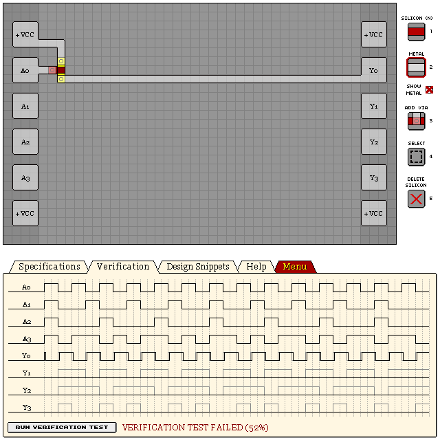

## AND Gate

Output is high if all inputs are high, else output is low.

### 2-Input

The larger variant on the left provides a stable output, while the smaller variant on the right has
varying lag characteristics due to propegation delay, which can also create unintended spikes in
some cases.

```
eNrtmW8OgyAMxSf1i2fYFfZ9Z9n9LzIl/oHSAo4ZUZ7OZMnvFbQtTxL7V/8cPt3w
7vrHL2ergWa+dgZ264msIhCBCEQgAm8dGHndpWY0yOovgXY7Z/TDUiISr3I6cls4
sr/5H58+VzQeM7YTBAIj9IgoM5pCGcqoGjWlWVgUuHdZhiWB0w2iwO2WJA4FXrPF
UqcIWLMGAt7MQX3CbvcFwmrwBHJ8RJC4A6GBWAkiWVLwqtDoIlCpP0BGn2b0SmrN
aY+sZZyNuD4QPydTWKyBPXsg3Yxmu4ktE87UnhUx7ZFuqVUry8ZBQUFB26aXt8rp
LYUSg4LWTQlWebIZEq8C2hIUtDrqL+JLGunVrRJtCQqKXSWsMkn51yW0JShohbvK
Rqyy9Pv7sjOU0pWmd3krgYK2SslfwwGlnfSYb9x/sUr5KqdlhZh3lHxjiaYFBa3N
Kt1VWjzyCY70Bc87x7Q=
```

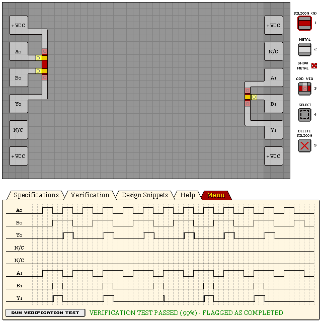

### 4-Input

Add or remove NPN gates to desired number of inputs. This design illustrates a 4-input AND gate.

Although it is possible to use one of the inputs in place of VCC, it can cause varying lag
characteristics and unintended side-effects similar to the 2-input single-NPN gate shown previously.

```
eNrtmUsWgyAMRYUwcQ3dQuddS/e/kXpSqT+irfipekEGenmK0fOMJ+EebuXTlQ8X
ijkdIcJlhb7uPwpdqxNVhAgRIkR4QaGmc95uSkUkOfJpxb3OET2me8113/uhiBNk
BA9XvQkOxRj3tlpbdfrWPbdwndLoAowZn3Y22otYn3p/Llq9Qf+KDxTONS3Kssav
vBMKhUKvTbHKXaiVfRIrKBSrxAw7/xRCrKBQrBKrJG+EQrFKaA4VjBQKPaFVLlD0
jluy6N2UQU06p+q8K51+EAJNMyh0gq5T417EKtMjn8Ykqz5mL7ubhx34mzVMKPmC
Tz59YgXd1JES7QUzx8cQ
```

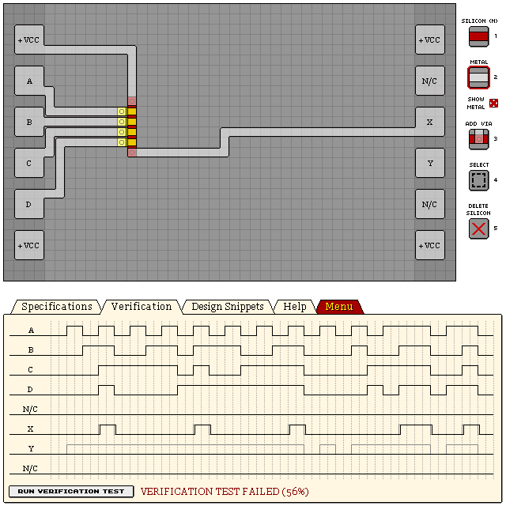

## NAND Gate

Output is low if all inputs are high, else output is high.

### 2-Input

The left design produces a stable output with rising/falling lag of 2/2. The design on the right is
smaller, and the varying lag characters can be beneficial, although it can produce unintended
side-effects.

```
eNrtml0SgjAMhIXlxTN4Bd89i/e/iAwyYNsklCK/WTodcD5jY5tuU2vzbB73d3V/
Vc2tpNBwpmHdlgLDqi+zDeuhcDgcG6YBUOcYpmGXhKFsKIVd9Pr0vVr8HYt7tXgc
OTsOaWgIs2VoLgVTLXI4rm7YpXO1fnUUgFiX05Z3Ff1T2G4WhUq/SKGjuULV3nBK
sYB68+pwFMMVRPzPPBrvaG4Kxp4YKV5Tl7T+zBJMUlJSUt/04lKJiewCDI9sCkSd
FtlGeDOfrXanfPY3vuZOCoz2C0ulKYYwbSG8g2KoCQuSh5j2u7j+vt02XG/X9tmj
kCKIeGXRoZD6k0rmjZfIG5lVMqukVK5LYeecAmZ4qPnbcFQGmUZ4M6+Mdm2fPY6v
eZQJSuVSqdz5pNuk5lqJjJWUYpi/1aVXJ6WQk0f5HFyj2ImG83/FM+6/SKVcl9M1
J4uUUiafDK6kpA6kcvjHUBDxZ/l99QiK9AEyr8dg
```

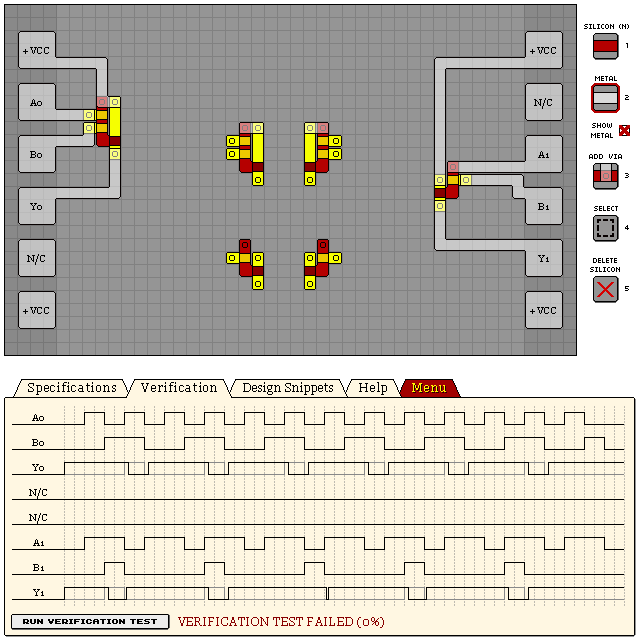

### 4-Input

The right design produces a stable output with rising/falling lag of 2/2. The design on the left is
smaller, and the varying lag characters can be beneficial, although it can produce unintended
side-effects.

```
eNrtmV0OgjAQhO0OL57BK/juWbz/RVRAFOj2B4GudGhITL6OjGucbN3m2lzOd3e+
uea0ZFGYLZR2ZQvdsLKEMlpHraosq6obrcVVlX+s6sR4qnBWrjyrX0+1WxxZVhxX
RXEopJBCy8K2nRP9aikA7/07fXLp9vSvRs8dKD47FNrv8FHfJ/roBF467AhSWZ12
oDn5ca9/YfixEBvFk+90Vf76KUc2SPgBprHk0i0DSwvKpCQlJSUlrZsePSrVplO+
mjhbnhH17G+Ud/P89qdqUcAVTLoiZVT+SRgipEWp2AmGISTuOXhg2ToMEXvn7sS0
bxhCCrkiZVSyb2TfyL6RlLSOA3i4f9OnLwU9h11Bn0WZiSwUiCyYdEVaW1SuMAKX
8AhcghTK0S8yAk+je4/AY70u4p1w/sSQlPRIdJsZ9ypR6b9/p+r/cyNXkT5q2mkl
FWSeoRYO72muSEnrppsn0vx6AORryBg=
```


## OR Gate

Output is high if any of the inputs are high, else output is low.

### NPN Design

By using multiple NPN gates (one for every 2 inputs), with a shared output, we create an OR gate
with a low rising/falling lag of 1/1.

```
eNrtmVsSgjAMRWnSH9bgFvx3Le5/I/LSKSVJKdiZQi+IM8zx0kfsNTX+6R/92/Uv
57sjJ4TVCl10ZrZIg4SW98yuHmwRccwWumNCIaqFW0QcjRkVVktaqKzPgi0ijhBC
WL9wSudIPybKzOJ1ng58fI33vuP5Nmj4h3mSaHT5gEqFIaUopSiF3QEFBbVosDq3
NJbvoCUtSbPCXV7ZJuXUF+C2s8FNjTeIM9YCKKwSFBQUFFaZTTmlPbsBv27eyHaW
db2cky0axll+MnJO0NazSnuLfecNODe1Abe32NiAg8IqraxyXQoSssq53KQaqaW9
9lzx7azSGlEY51wtjAVWuZb/ochN3wq2XKcmk7KS7RSvcduTiSonKOjOP6PqqYAX
tkr5Ok+ViY66vUn/oj5HCSJ+DUFBa6KJ9Zv/5OKOtD0+NePHHw==
```

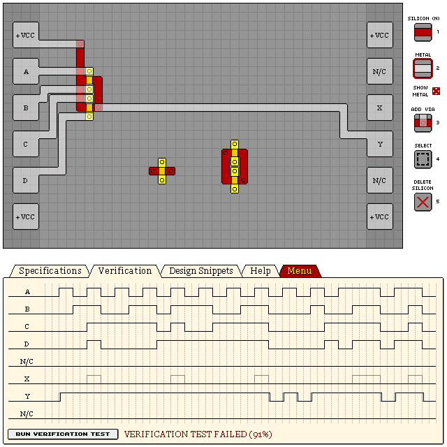

### "NOT-NOR" Design

Using an inverter on a typical NOR gate results with fairly high rising/falling lag of 2/2.

```
eNrtmWsOgyAQhAvjH8/QK/R/z9L7X6QvUossDwVEZSQmTT7HArsdljLchuv4UONd
DZc1jcKthMq0hUL919Ra4bsxHBRWFEZTWxYmpHZYGEjtk8yqypsctVYYnVn+Oiik
sLzwU85p//WhAMQ7n764/j5jPlnf+6OYnvBQ84REpRFNZMad2QBpXWoCcLAR2fnI
+G5MazqSzwmTrJKUlJS0b9q1VfprTnlBY/IUp04AnBjtsc+I9QqML63yRGZYYAPO
1MozQ8jc2uruzQwhj8p+Mxh9WuXJrJJ1Y2OrPFzdCNaNtMrOJgRhI4XLmTyFKcJG
mrDVbdLnkJFC5Ix+H1ZZ4Ixbh8+4dZBivqtJO+MuMl08bSQl3Rutc8ZdxCrlO5+m
/R8Vqe7mC/miegZcSRvX9occERjBlrS6I7nXEz9Ax14=
```

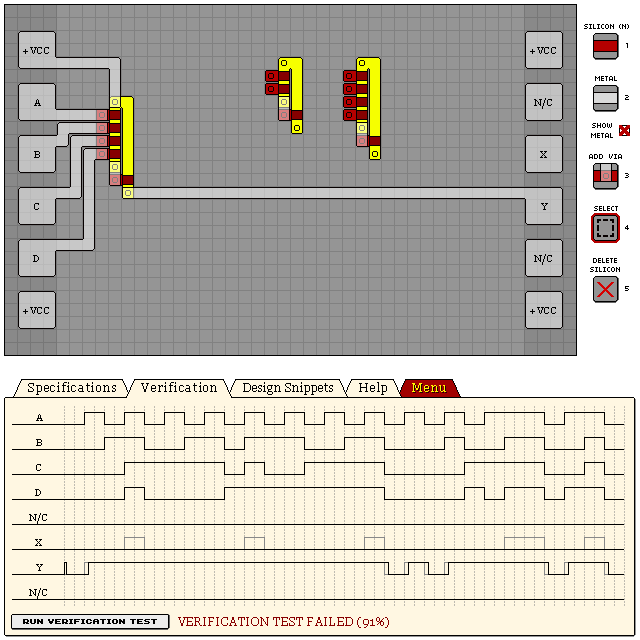

## NOR Gate

Output is low if any of the inputs are high, else output is high.

```
eNrtmlsOgyAQRcsMP66hW+h/19L9b6RWNCKv4oN+lAMhMR4vwgSvmNE+7H14meFp
7O1IRfgroZnrTqF4lagiRIgQIUKEfyuctnOSLxNV1WQ7T8d9xnjoTsjS1huvWNdL
PCwena9I0c9M41k5Jn6vG7qUzqgLOeGAXk5VCzRQV9CGtpS1wyq/hEKh0L5p11ap
wcuO5QGFQru0yqIZVnyBs3igUGjvVskCgEKhWOVXqhgpFAq90CrPZZRc+jqT555T
1VKk6n8xxzRjd1oVEDKVUGhruj/HXaZtctyXWGW6nafpOIfDjuxwO+bgd6G6gMQO
y5sUCm1Di8/vgZ6bO1Jc3ivWxtw=
```

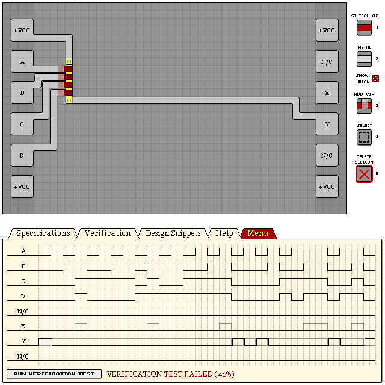

## XOR Gate

Output is high if only an odd number of inputs are high, else output is low. For a 2-input XOR, it
is only high while only one input is high.

```
eNrtmk0WgjAMhCXDxjN4BfeexftfRJ/if9qURGiBgYebz6FpaMeU2h/7w/7c7U9d
v/OcFI4Uik/YDaerRbFbTbUo3uQIB0C5UHxCZVCUt/g1KMa0KN7kyHKe47zJCT2O
bsYhx4lMIYVtC2/lnKSPGwWgXnF65cP1+Hxvd6D3I0n1mFXdGx2+kabKjeUjV6hM
nwG6KLz0lZeWsmFEFehvKM9tjpx5qTEHs7MMFRwp5YRFVrlVCmZDpWBUpJujK7dK
VNK2TlFJyx6R0ipbNEMYlWF2Ab7smjM7/WHUYEBWW6u6C0Rl9Ag0UtJNW6VJsWAz
jFRKFkWTS124Y45kg9ZBuv4FONKbPnZFmtcuOlfQNyPKKtK8lj0i3bBVTr7Hnafp
Pe4sTfjd395GrngHvMn+GtmQQH+5xz0hja37pnCkSa1Sv+K0KOzf//wUabWycExF
yl9S37tKRkX6Wa78/84VHOkC2inHOw==
```

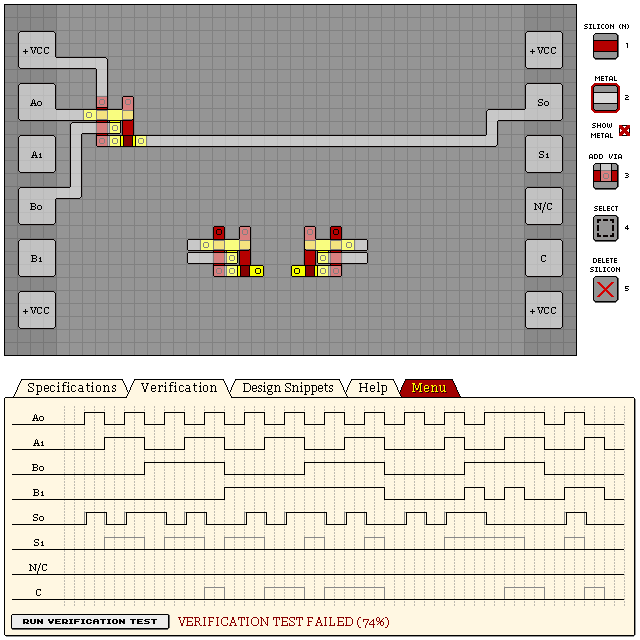

### Simplified Design

```
eNrtml0WgiAQhYXhxTW0hd5bS/vfSDWmcWwYQaX4uXHw5esKjXQdHN3VXca7GW/G
DXsahMULLR9NqtBws9yShJNkkidO1XgTxnUsUCispRihuJZihOJaipuqsJZwHSGE
EMLGhZzO2fCHKRGJ/Th98nefj/64p1Di0YJU+r2TiNbKhbph/oaI7TxwkH5NuSb6
iZpAvbAkU/3MDUayE7r5T7E2mea0pJAVRnklKCgoaN8UVqlmhntpt5EMZoYRFJEE
hVVWaIavrDy8rdBpy0aq2p0XlmQKIwWFVVaZN+bTNpw35tOCgsIqi6T8sHcn7TaS
XliSKSIJWr1VFl7k1mmoyL25Ader2A3XuHW6UQFfwoIaN6hETqF5atynWKXcj9Mf
3B3WbypEaVlE6pkJ91mJ0gGKSDb5mIvO33/9wZEecvfHLQ==
```

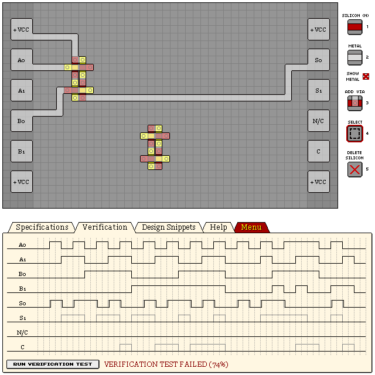

### Old Design

An old deprecated design that brute-forces a result for each combination of inputs. Pretty laggy.

```
eNrtmkESgjAMRSVhwxm8AnvP4v0vIiIojmkoiS2lfBjcvPlSM/XZUNu+vXb3prs1
7cVyIpgvSNNpCDbDaQxS9qCxOJg5kUFxHsUFhXkUG6TsQWNxMHMQRBDBwwbH5RyF
j5Eys3j56cCna35d3neiryNAn1wa8zsXoKRmZ2zPMimUaV/6Gfq/KXneuchage5I
mfMbKWTCKFWelSbTXb2VZI0y2SnmJOi+tHpVrqwbMT0E3TGqAQp6MlWyS6Se9vyw
a052idRBHStSfMFBoUqnKn8eVn5TstNaG/BFyURKdooGHBSqLFeVjuZdlyFXq0pH
867LkKFK0JpVmXyPW6XKHndEE+1qse0i9TwWKHsHXN/jXrlvkdUALZZyEiMlVaV8
+WnMsOfPuVVK0j+FKNf+OH6FN685USvQeFVmN9ID7gbHJQ==
```

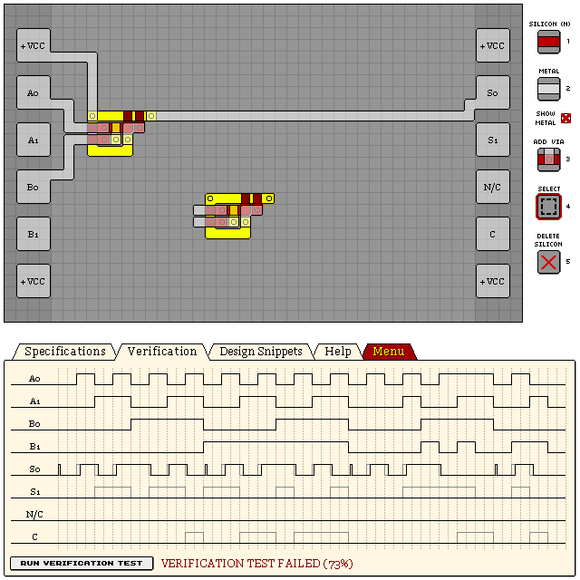

### Larger Old Design

Another old deprecated design that brute-forces a result for each combination of inputs that I found
somewhere while trying to find a better design than my other old bruteforce design. It worked better
than the above one so I used it for a time.

```
eNrtmVkSgyAQRHWGH8+QK+Q/Z8n9L5IUZkFlcwZw61jk51Uj1YXt4Ji7uQ3Pfnj0
ppNcEO5c2DtXG2FnyA6SLZWk5hA2wOmE3k1YVejdvfl3JKk5hA0AIYQQ6oW2nKPw
z1Jm9g49ffPP+P679/1Rtoog9a05Scc5A3TUs5TyfMFT7fK2p6F/SyWUpdQx/Bo+
H4guH4Xpc0QCWjORQkmYFZWg6ynDjbaU4QZoTYqojL3RWKGFk2tpoObM1cJJUERl
HcqayjB+AEfN6aOsqQwDB/ACMyMcQBGV6ahkYVXJqm8719x4juHrq0pOxB3CEBRR
WSsqo82XZGsmPjO2licqA82XHJqcGT6Dbh+VDXrccSrrcWdUhvIOOCm+ZKIDLuiA
U1R7NZ8PRGU97jit0+MuEpX+oaeZy55XaQXeHb7Cr2i9ind043oVbuyT1jhhbZBI
LyYxxyk=
```

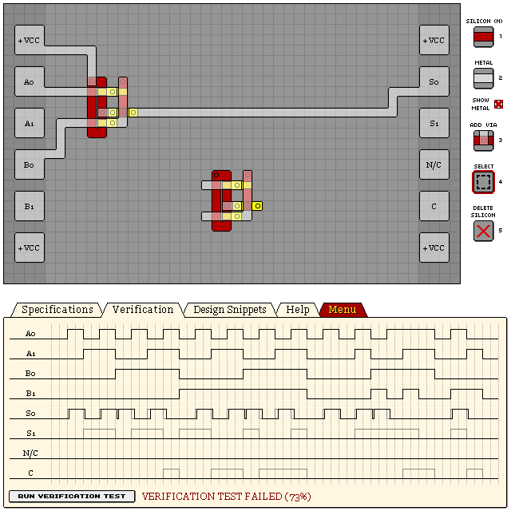

## XNOR Gate

Output is low if only an odd number of inputs are high, else output is high. For a 2-input XNOR, it
is only high while all or none inputs are high.

```
eNrtmkESwiAMRaVh0zN4BfeexftfRKfiyGhIgRZh7CuDm+dvaRo/Qeov/jzf3Hx1
/lTTEA4vdN7VCKfQioUutIqhZlyPBDiWUMmkHKGavTlCNXvzhqpkL88RIUKEPxUu
5dyUPhYqImrfTh889NdnfN0d6PNIUv1+VV1EwxfSdLLpx3iPQ99RUWgU0mJqn5mn
MC5d+R11cKSUE2ZZJRQKhR6bYpXGfFdPiWQFTVSGWZRIQrHKTmYo5sJB1pYVpFap
3UUhLaYYKRSr7FY3ttNilT/WQqFYZTMqds2JVe5Nxa45sUro+FY59B63TdN73KsL
cPa4R9oBZ4/7P6nYa7cmjtTUKvW+nTafHb7f+cnSakUj8ywUOsafYB0c6Q57gMcH
```

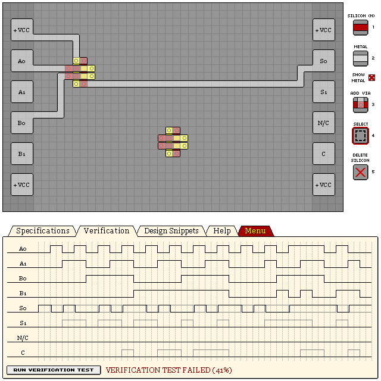
