# Logic Gates

- [NOT Gate](#not-gate)
- [AND Gate](#and-gate)
- [NAND Gate](#nand-gate)
- [OR Gate](#or-gate)
- [NOR Gate](#nor-gate)
- [XOR Gate](#xor-gate)
- [XNOR Gate](#xnor-gate)

## NOT Gate

<a href="https://openkonstruktor.natecousins.com/?level=01+KT411I+QUAD+INVERTER+GATE&design=eNrt2UEOgjAUBUDLZ8MZvAJ7z%2BL9L6I2LtvUUAhqB%2Bhq8iDQ5AHpvM7X5Z6WW5ovW%2FYxg2lbcMq7pyooKCgoKCi4ezB%2Fzk31LWtEFEe%2FPj0f5es29XWuqr7zlNI%2F0yMbqdaEH1UlpZSOrb9elWESKaWqslGGrR9wU0wpVZUmkVKqKtsaipRS%2Bi1VeeIad%2FOmrAlSOpoes8a9S1WWR7%2F29X%2BE9x2l4%2BkJjfQA0SLGgw%3D%3D" target="_blank">View in Open-Konstruktor</a>

Output is high if input is low, and vice-versa.

```
eNrt2UEOgjAUBUDLZ8MZvAJ7z+L9L6I2LtvUUAhqB+hq8iDQ5AHpvM7X5Z6WW5ov
W/Yxg2lbcMq7pyooKCgoKCi4ezB/zk31LWtEFEe/Pj0f5es29XWuqr7zlNI/0yMb
qdaEH1UlpZSOrb9elWESKaWqslGGrR9wU0wpVZUmkVKqKtsaipRS+i1VeeIad/Om
rAlSOpoes8a9S1WWR7/29X+E9x2l4+kJjfQA0SLGgw==
```

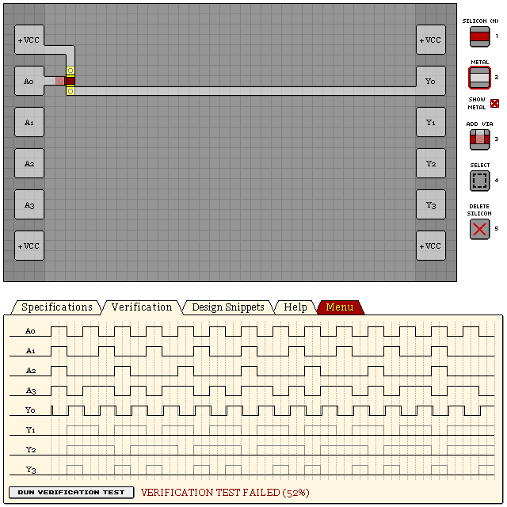

## AND Gate

Output is high if all inputs are high, else output is low.

### 2-Input

<a href="https://openkonstruktor.natecousins.com/?level=02+KT221A+DUAL+2-INPUT+AND+GATE&design=eNrtmUEOwiAQRYVh0zN4Bfc9i%2Fe%2FiAbRCC1QSypQXglpk5cPgTKfIZibuU53Nc3KXPaUUYXa1R%2BF6lOYVYQIESJEeGphYrvL9aiZ1T1Cm87p%2BGOpiKzWcvrktor78vvNUtvQ%2BxXS1IigUOj%2F6CvoJUb9CN9Aj3Sk2Ig2WSUUCoWOTbu3SvHzTX4xFNog7f%2Fc14FVJs1wcTZnWUKhzVE%2FiLs00t6tkmUJhZJVYpVZGl7psCyh0AazykGssuId94l2JSh0VCp%2BDFe9AT%2FYKtdrOS37ES6jDBNLFi0U2ppVfkdpccsVHOkBanXGfA%3D%3D" target="_blank">View in Open-Konstruktor</a>

The larger variant on the left provides a stable output, while the smaller variant on the right has
varying lag characteristics due to propegation delay, which can also create unintended spikes in
some cases.

```
eNrtmW8OgyAMxSf1i2fYFfZ9Z9n9LzIl/oHSAo4ZUZ7OZMnvFbQtTxL7V/8cPt3w
7vrHL2ergWa+dgZ264msIhCBCEQgAm8dGHndpWY0yOovgXY7Z/TDUiISr3I6cls4
sr/5H58+VzQeM7YTBAIj9IgoM5pCGcqoGjWlWVgUuHdZhiWB0w2iwO2WJA4FXrPF
UqcIWLMGAt7MQX3CbvcFwmrwBHJ8RJC4A6GBWAkiWVLwqtDoIlCpP0BGn2b0SmrN
aY+sZZyNuD4QPydTWKyBPXsg3Yxmu4ktE87UnhUx7ZFuqVUry8ZBQUFB26aXt8rp
LYUSg4LWTQlWebIZEq8C2hIUtDrqL+JLGunVrRJtCQqKXSWsMkn51yW0JShohbvK
Rqyy9Pv7sjOU0pWmd3krgYK2SslfwwGlnfSYb9x/sUr5KqdlhZh3lHxjiaYFBa3N
Kt1VWjzyCY70Bc87x7Q=
```

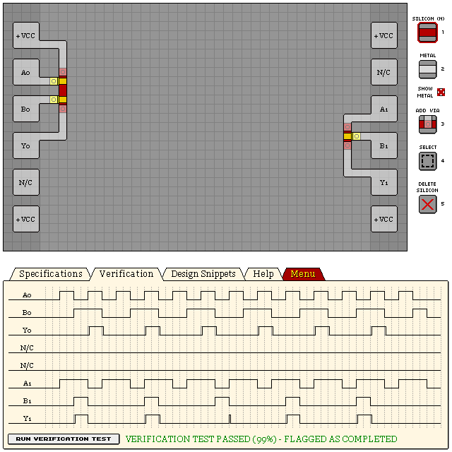

### 4-Input

<a href="https://openkonstruktor.natecousins.com/?level=03+KT141AO+4-INPUT+AND-OR+GATE&design=eNrtmVsOgyAQRcsMP66hW%2Bh%2F19L9b6QNkeKDqbZQreWAfODhRhyTy5jxF3%2Fubq67On%2F6pCNEWFcofX9T6AadqCJEiBAhwgaFIZ0TuwWqqtlRTh9cwhoN98IsPTfOVdOKPJ3v%2BWfp80U0Q1Nri06CNaUiUOhGjmQ54SqrhEKh0LYpVrkLtXJOYgWFYpWY4eifQokVFIpVYpXkjVAoVgktoYqRQqF%2FaJUVatzxsmvcIq%2FokWrcKz8EFXCDQaEL9Ds17ipWmR%2FlNCZZ%2FT172%2BM87MBn1jyh5ARf%2FPrECrqpI2XaHV3Pxu4%3D" target="_blank">View in Open-Konstruktor</a>

Add or remove NPN gates to desired number of inputs. This design illustrates a 4-input AND gate.

Although it is possible to use one of the inputs in place of VCC, it can cause varying lag
characteristics and produce unintended spikes similar to the 2-input single-NPN gate shown
above.

```
eNrtmUsWgyAMRYUwcQ3dQuddS/e/kXpSqT+irfipekEGenmK0fOMJ+EebuXTlQ8X
ijkdIcJlhb7uPwpdqxNVhAgRIkR4QaGmc95uSkUkOfJpxb3OET2me8113/uhiBNk
BA9XvQkOxRj3tlpbdfrWPbdwndLoAowZn3Y22otYn3p/Llq9Qf+KDxTONS3Kssav
vBMKhUKvTbHKXaiVfRIrKBSrxAw7/xRCrKBQrBKrJG+EQrFKaA4VjBQKPaFVLlD0
jluy6N2UQU06p+q8K51+EAJNMyh0gq5T417EKtMjn8Ykqz5mL7ubhx34mzVMKPmC
Tz59YgXd1JES7QUzx8cQ
```

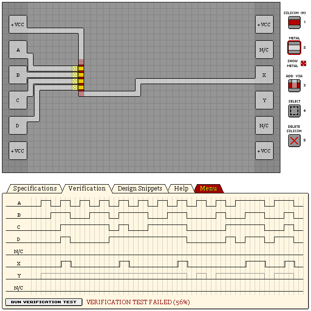

## NAND Gate

Output is low if all inputs are high, else output is high.

### PNP Design

<a href="https://openkonstruktor.natecousins.com/?level=03+KT141AO+4-INPUT+AND-OR+GATE&design=eNrtmdEWgiAMhoN54zP0Ct33LL3%2Fi1RogrqhgJi6X%2BLU6XMOmP5uh%2BbR3NuXaZ%2BmueU0GB7W0DItwaNxBmb4ThhqpkfE8QSGs5iuM2Tuosoe9YRj9KilhSMIS2WPeKxgCMNdDF06Z%2BXDUSJiezn98O5D7r%2Fvz8Cvp%2F4Mgc7GXEbtEh3OqUKDqXKUixEoqB5aU5EkJVwllTop9WKJ1Uihw4pdakZuVoivagqpBAUFBYVUSpSWbMsL8KvmjTHqV4y%2FMp1yRt2s5Csj54RUai6xUYDnlNhnLMDjJTYKcFDdWeXvkLPKrolCGrHVnFVStu0fpbKPpTQjspRlC9nRJpWb7HFb3yeFcJC9HW6PO76Y1XbAo35BQZXTOnvcm0gl38tp%2BHKOD3uUxF39jaY0XwUFXUd3UKTp8QZ%2BZ8db" target="_blank">View in Open-Konstruktor</a>

By using multiple PNP gates (one for every input) with a shared output, we create a NAND gate
with a low rising/falling lag of 1/1.

```
eNrtmVGSgjAMhqU/L57BK+y7Z/H+F1laXCi1yZZCUcxfZJzxS9ImtSEZ+p/+dn10
13vXX2ouKn6sostcK2bsgkI3fa9YauWM3McTKL7saZli5l/UeEY727E4auu2I9qW
xjPyWFGRiocohnLOySNQANl7Ox348PErgR/jooaveHYvE370QpFoKuNikdlF3dTE
VZlYao5XiUz0OMJrYJdCiZGliIvckkRCXEUDqfnduWtr/uzcEX8aTo/TAflOyrNF
idgm9dFTMxtjlaFTxL7Ko+AV99c0ZaokJSUlZaqUKP7TfdYS0CybrDmh0Tliecs4
pUejV7Jl1pxMlZZbbDbgNS32GRtwvcVmA05qu6r8G3JVOV5iIlV0LVeVqNZ9Y6p8
7qXkERyqdJl2rKXK7W/Qx0OCzGHB1OI4lSLfRFfTwhZbDyYaUajzkpIap23ece+S
KvP3dho/nPVlL4q4b3+iGa1XSUnL6AEZKR2/7qHIFw==
```

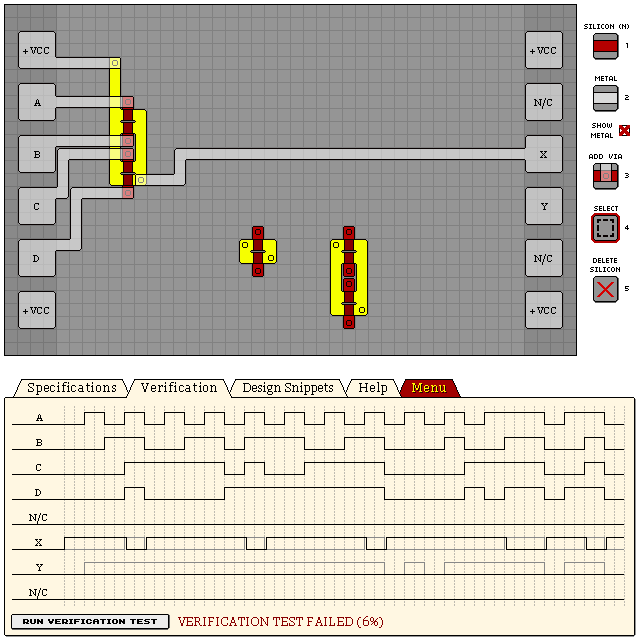

### "NOT-AND" Design

<a href="https://openkonstruktor.natecousins.com/?level=03+KT141AO+4-INPUT+AND-OR+GATE&design=eNrtmVGOwyAMRBdPfnqGvUL%2F9yy9%2F0W6yibpQsAGEkqaDChSpYfLYKqRUw%2F34fv2cLcfN3zVTAYWB8o4iwPdMosCxZtnzarUZdV5szqr4pGqMwYKSpLjKTj2PVZKDa6oVOqy6yckR%2BqT48oCg18wnZyBDDxD4FjOSXqMFED02U5%2FufytmT55%2By4UrxUJOq2I0diJXnGCKF1WqFR2pxOI0xkEooMbJC2m2ECZyQ60pSOlnDDLKklJSUmvTc9ulcmqUv6XaYfSDFNzvBIOB%2FR90ee80%2BHSseikytgXtA5a5ZnNEFos8m3njWYIsTX70uP7wjJS9DBDWN%2BMRqakmqGuak42rYNWybqRdSPrRtaNpBd%2BAdfrt3R7paNmXRXSzaaVNxjW0eW8sIwU6KQKOqWR0iobd8Dnzrbe4xaVIiy18nrcefTdPW6r1oVdCbMHujNlj%2FvDaJse9y5WGX%2B20%2BT%2Fc54qo44KK62shKw99Agv73mqSEmvTZs70no8AReXyAA%3D" target="_blank">View in Open-Konstruktor</a>

The right design produces a stable output with rising/falling lag of 2/2. The design on the left is
smaller, and the varying lag characters can be relatively beneficial, although it can produce
unintended spikes.

```
eNrtmVGSgyAQRMO0PznDXiH/e5a9/0V2Y4xZEGYAJRhtKatS9RhphqRrzAy34ev6
467fbrjUDAYWB8o4igPdPIoCxRtHzarUZdV5ozqr4pGqPQYKSpLjKdj3OVZKDY6o
VOq86ickR+qT48oCg28wnZyBDDxC4FjOSfoaKYDovZ7+cXnMmT55684UrxkJOs2I
0diOXnGCKJ1nqFQ2pw8wXOJ4ir9jxLEQr8VYhZMPD850U37/KRsTRF9g11hKaUvD
ShlllpOSkpKSnpse3SqTRaf8K+L2pRmm5nihHF7Q10Wf/U6bS8eikypjXdA6aJVH
NkNosci3nTeaIcTW7EuPrwvLSNHDDGE9GY1MSTVDXdUz2bQOWiXrRtaNrBtZN5Ke
+AVcr9/S3ZeOmnVVSPeiFt5gWEeX/cIyUqCTKuiURkqrbNwgfza+9Ra4qBRhqZXX
As+j726BW7Uu7Eq4vGNIqlIwG59F2/S4N7HK+L2eJv+f81QZdVRYaWUlZOmhe3h5
z1NFSnpu2tyRltcvu1nIPg==
```

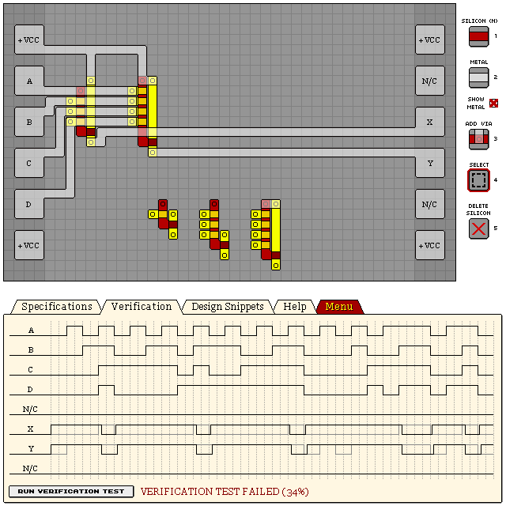

## OR Gate

Output is high if any of the inputs are high, else output is low.

### NPN Design

<a href="https://openkonstruktor.natecousins.com/?level=03+KT141AO+4-INPUT+AND-OR+GATE&design=eNrtmVESgiAQhoP1xTN0hd47S%2Fe%2FSOpYIcIiGjMon0YzzdcvyMrf0naP7t6%2FTP803W3PibBaofHOzB7tILHze%2BZQd%2FZIHLOFZp8wENXCPRJHZUYDqyUtjKzPgj0SR4QI6xdO6ZyNHxMVkWA7Tgc%2BvsbP9tN%2B%2FX6piCh0%2FkKUBu4oRW2KWnc4UChUo87qXFNfvoGWdKSYE26yyjappB6Ay86GNHW%2FTpxZC1CsEgqFQrHKbCop7dEN%2BHnzRtGzrPPlnKJRN87hK5NzQlvPKvUt9pU34NLUBlzfYrMBh2KVWla5LAUFssq52hQzUk177rmSy1mldkdunHO1GAtWuZT%2FocZt9Rq3ValEsp3iNW59MqlyQqEb%2F4yqpwJe2CrD7TiNTLQ37FX6543ZSxD5NYRCa6KJ9Zt%2F5eKOtD7ewsTHHQ%3D%3D" target="_blank">View in Open-Konstruktor</a>

By using multiple NPN gates (one for every 2 inputs) with a shared output, we create an OR gate
with a low rising/falling lag of 1/1.

```
eNrtmVsSgjAMRWnSH9bgFvx3Le5/I/LSKSVJKdiZQi+IM8zx0kfsNTX+6R/92/Uv
57sjJ4TVCl10ZrZIg4SW98yuHmwRccwWumNCIaqFW0QcjRkVVktaqKzPgi0ijhBC
WL9wSudIPybKzOJ1ng58fI33vuP5Nmj4h3mSaHT5gEqFIaUopSiF3QEFBbVosDq3
NJbvoCUtSbPCXV7ZJuXUF+C2s8FNjTeIM9YCKKwSFBQUFFaZTTmlPbsBv27eyHaW
db2cky0axll+MnJO0NazSnuLfecNODe1Abe32NiAg8IqraxyXQoSssq53KQaqaW9
9lzx7azSGlEY51wtjAVWuZb/ochN3wq2XKcmk7KS7RSvcduTiSonKOjOP6PqqYAX
tkr5Ok+ViY66vUn/oj5HCSJ+DUFBa6KJ9Zv/5OKOtD0+NePHHw==
```

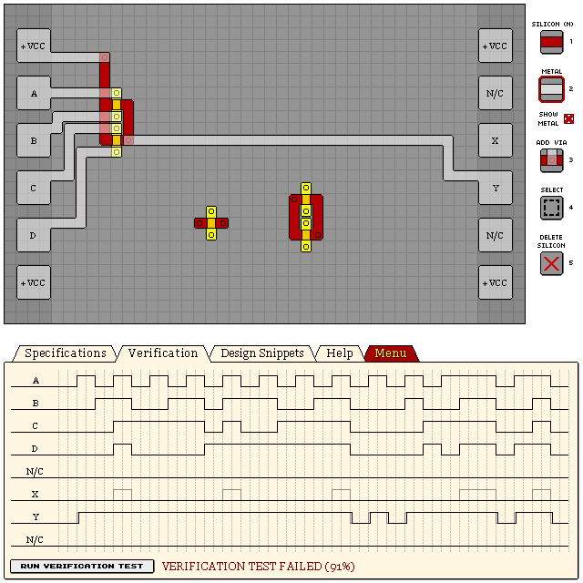

### "NOT-NOR" Design

<a href="https://openkonstruktor.natecousins.com/?level=03+KT141AO+4-INPUT+AND-OR+GATE&design=eNrtmWsOgyAQhAvjH8%2FQK%2FR%2Fz9L7X6QvUossDwVEZSQmTT7HArsdljLchuv4UONdDZc1jcKthMq0hUL919Ra4bsxHBRWFEZTWxYmpHZYGEjtk8yqypsctVYYnVn%2BOiiksLzwU85p%2F%2FWhAMQ7n764%2Fj5jPlnf%2B6OYnvBQ84REpRFNZMad2QBpXWoCcLAR2fnI%2BG5MazqSzwmTrJKUlJS0b9q1VfprTnlBY%2FIUp04AnBjtsc%2BI9QqML63yRGZYYAPO1MozQ8jc2uruzQwhj8p%2BMxh9WuXJrJJ1Y2OrPFzdCNaNtMrOJgRhI4XLmTyFKcJGmrDVbdLnkJFC5Ix%2BH1ZZ4Ixbh8%2B4dZBivqtJO%2BMuMl08bSQl3Rutc8ZdxCrlO5%2Bm%2FR8Vqe7mC%2FmiegZcSRvX9occERjBlrS6I7nXEz9Ax14%3D" target="_blank">View in Open-Konstruktor</a>

Using an inverter on a typical NOR gate results with fairly high rising/falling lag of 2/2.

```
eNrtmWsOgyAQhAvjH8/QK/R/z9L7X6QvUossDwVEZSQmTT7HArsdljLchuv4UONd
DZc1jcKthMq0hUL919Ra4bsxHBRWFEZTWxYmpHZYGEjtk8yqypsctVYYnVn+Oiik
sLzwU85p//WhAMQ7n764/j5jPlnf+6OYnvBQ84REpRFNZMad2QBpXWoCcLAR2fnI
+G5MazqSzwmTrJKUlJS0b9q1VfprTnlBY/IUp04AnBjtsc+I9QqML63yRGZYYAPO
1MozQ8jc2uruzQwhj8p+Mxh9WuXJrJJ1Y2OrPFzdCNaNtMrOJgRhI4XLmTyFKcJG
mrDVbdLnkJFC5Ix+H1ZZ4Ixbh8+4dZBivqtJO+MuMl08bSQl3Rutc8ZdxCrlO5+m
/R8Vqe7mC/miegZcSRvX9occERjBlrS6I7nXEz9Ax14=
```

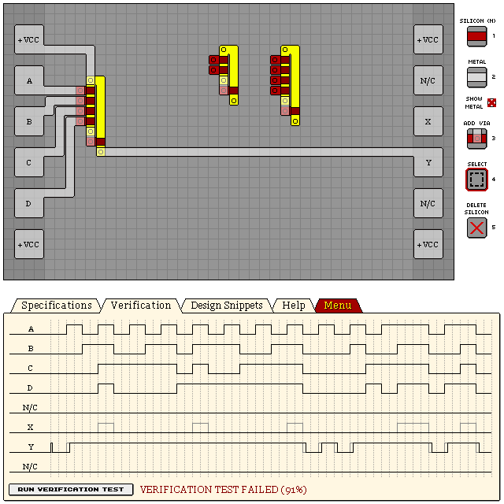

## NOR Gate

<a href="https://openkonstruktor.natecousins.com/?level=03+KT141AO+4-INPUT+AND-OR+GATE&design=eNrt2kEOwiAQhWFh2PQMXsG9Z%2FH%2BF9FUaksZEFpwIT%2BkicnHaCX02QbdzV2nh5nuxl2OdAp%2FVWh8ryy0m86sUkghhRRSSOHfFs63czbdZhUR9TivL7fvMf5V8LkflXVEQv0ITbVvtIqoujQURRtoeBlGmVOrPRMplYRFUYmiKDq2Dh2V6XtOlgeKogNFZTYMCx7AWTwoio4elSwAFEWJyq8qBCmKog2jssEet83vcdusyvaJOdbUHnfRhLBTiaK9tX6PO6999ribRKV%2BnFd9nvenHcVheM67%2FwqVTUicsPySomgfzV6%2FB965eyLF7Qnn5cbS" target="_blank">View in Open-Konstruktor</a>

Output is low if any of the inputs are high, else output is high.

```
eNrtmlsOgyAQRcsMP66hW+h/19L9b6RWNCKv4oN+lAMhMR4vwgSvmNE+7H14meFp
7O1IRfgroZnrTqF4lagiRIgQIUKEfyuctnOSLxNV1WQ7T8d9xnjoTsjS1huvWNdL
PCwena9I0c9M41k5Jn6vG7qUzqgLOeGAXk5VCzRQV9CGtpS1wyq/hEKh0L5p11ap
wcuO5QGFQru0yqIZVnyBs3igUGjvVskCgEKhWOVXqhgpFAq90CrPZZRc+jqT555T
1VKk6n8xxzRjd1oVEDKVUGhruj/HXaZtctyXWGW6nafpOIfDjuxwO+bgd6G6gMQO
y5sUCm1Di8/vgZ6bO1Jc3ivWxtw=
```

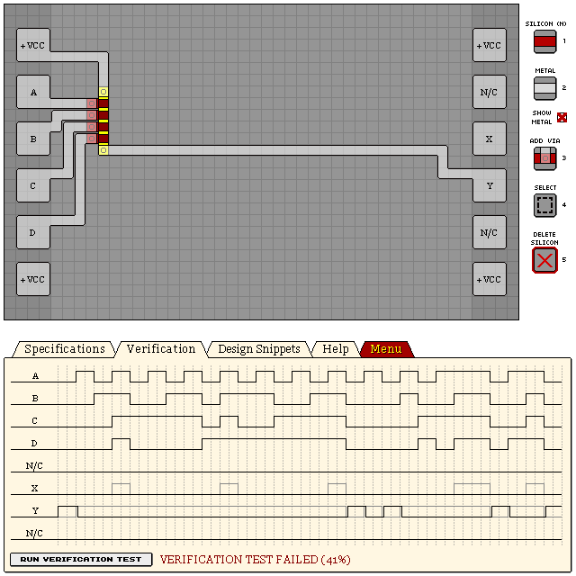

## XOR Gate

<a href="https://openkonstruktor.natecousins.com/?level=10+KA180+2-BIT+ADDER+WITH+CARRY&design=eNrtmk0WwiAMhIV00zN4BfeexftfRA1aeTWh0ILyM%2FLo5nMKpjgNTafLdJ5vZr6a6bSnQVi90PLRpAoNN8stSegkTp44VeNNGNexQqGwlmKE4lqKEYprKW6qwlrCdYQQQgg7F3I6Z%2FUPUyIS%2B3H64K%2F%2BPvrjZqHEo6lU%2Br1ORGvlQpcvaNSNq9KvGbdEP0ETqBeWZBo%2Bc4eRHIRu%2FlOsTaYlHUlzwiirBAUFBR2bwiqDmeFeOmwk1cwwgiKSoLDKBs3wmZXr24ow7dlIg3bnhSWZwkhBYZVN5o3ltB3njeW0oKCwyiopP%2BzdSYeNpBeWZIpIgjZvlZXXuMNUq3FvbsDDVeyOa9xhulEBX8KCGjeoRLLQMjXuLFYp9%2BP0B3eH9ZsKUVoWUfDMhPusROkARSS7fMxF%2Bfdff3CkO%2F5exys%3D" target="_blank">View in Open-Konstruktor</a>

Output is high if only an odd number of inputs are high, else output is low. For a 2-input XOR, it
is only high while only one input is high.

```
eNrtml0WgiAQhYXhxTW0hd5bS/vfSDWmcWwYQaX4uXHw5esKjXQdHN3VXca7GW/G
DXsahMULLR9NqtBws9yShJNkkidO1XgTxnUsUCispRihuJZihOJaipuqsJZwHSGE
EMLGhZzO2fCHKRGJ/Th98nefj/64p1Di0YJU+r2TiNbKhbph/oaI7TxwkH5NuSb6
iZpAvbAkU/3MDUayE7r5T7E2mea0pJAVRnklKCgoaN8UVqlmhntpt5EMZoYRFJEE
hVVWaIavrDy8rdBpy0aq2p0XlmQKIwWFVVaZN+bTNpw35tOCgsIqi6T8sHcn7TaS
XliSKSIJWr1VFl7k1mmoyL25Ader2A3XuHW6UQFfwoIaN6hETqF5atynWKXcj9Mf
3B3WbypEaVlE6pkJ91mJ0gGKSDb5mIvO33/9wZEecvfHLQ==
```

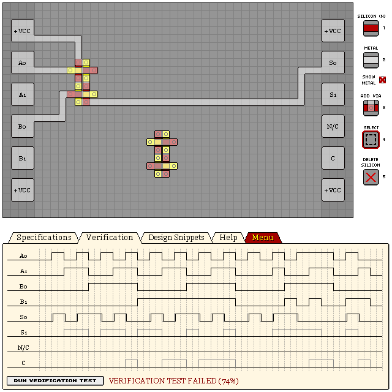

### Compact Design

<a href="https://openkonstruktor.natecousins.com/?level=10+KA180+2-BIT+ADDER+WITH+CARRY&design=eNrtmk0WgjAMhCXDxjN4BfeexftfRJ%2Fif9qURGiBgYebz6FpaMeU2h%2F7w%2F7c7U9dv%2FOcFI4Uik%2FYDaerRbFbTbUo3uQIB0C5UHxCZVCUt%2Fg1KMa0KN7kyHKe47zJCT2ObsYhx4lMIYVtC2%2FlnKSPGwWgXnF65cP1%2BHxvd6D3I0n1mFXdGx2%2BkabKjeUjV6hMnwG6KLz0lZeWsmFEFehvKM9tjpx5qTEHs7MMFRwp5YRFVrlVCmZDpWBUpJujK7dKVNK2TlFJyx6R0ipbNEMYlWF2Ab7smjM7%2FWHUYEBWW6u6C0Rl9Ag0UtJNW6VJsWAzjFRKFkWTS124Y45kg9ZBuv4FONKbPnZFmtcuOlfQNyPKKtK8lj0i3bBVTr7HnafpPe4sTfjd395GrngHvMn%2BGtmQQH%2B5xz0hja37pnCkSa1Sv%2BK0KOzf%2F%2FwUabWycExFyl9S37tKRkX6Wa78%2F84VHOkC2inHOw%3D%3D" target="_blank">View in Open-Konstruktor</a>

Smaller design, but can produce spikes in certain situations. Not recommended unless going for
low design score.

```
eNrtmk0WgjAMhCXDxjN4BfeexftfRJ/if9qURGiBgYebz6FpaMeU2h/7w/7c7U9d
v/OcFI4Uik/YDaerRbFbTbUo3uQIB0C5UHxCZVCUt/g1KMa0KN7kyHKe47zJCT2O
bsYhx4lMIYVtC2/lnKSPGwWgXnF65cP1+Hxvd6D3I0n1mFXdGx2+kabKjeUjV6hM
nwG6KLz0lZeWsmFEFehvKM9tjpx5qTEHs7MMFRwp5YRFVrlVCmZDpWBUpJujK7dK
VNK2TlFJyx6R0ipbNEMYlWF2Ab7smjM7/WHUYEBWW6u6C0Rl9Ag0UtJNW6VJsWAz
jFRKFkWTS124Y45kg9ZBuv4FONKbPnZFmtcuOlfQNyPKKtK8lj0i3bBVTr7Hnafp
Pe4sTfjd395GrngHvMn+GtmQQH+5xz0hja37pnCkSa1Sv+K0KOzf//wUabWycExF
yl9S37tKRkX6Wa78/84VHOkC2inHOw==
```

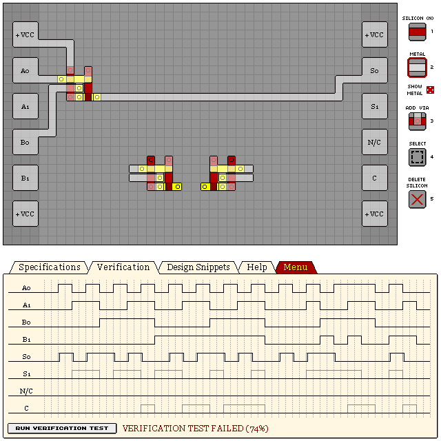

### 4-Input XOR Gate

<a href="https://openkonstruktor.natecousins.com/?level=10+KA180+2-BIT+ADDER+WITH+CARRY&design=eNrtmVsagiAQhYXxxTW0hd5bS%2FvfSIWSqMOIoB8CRyOi3%2BOFxtMI%2FbN%2FDG81vFTfxayFChWzBh9RatUj1I7k9675XWyFyoi1EahVWxCOm9ifQq3aYgCoaQf2s9sOjhwVG3IQ7ggDI6dj4igoctbrgcjphEgq3%2BUghBDC5oQmndP%2BxVAiYks6%2FXL7muv%2FcbX77a0omWWuj1CzR3LqJZ22WNQnUntmLPX3xgnU0xtBVMvn7L9e0CrplY7kc8IgqwQFBQVtm8Iq42hKvtpqT6bkq4g60Natkoo0w1%2FKPpKxPkIrNlL5AZzvjSAKIwVFVmlvAboZtYOo0k1Kos3GaUumKYYGMwSFVYpZpV2K6kwzEmxHiH1U87TRwCO5N9BXoBVYZYtz3Hsz4MvCaLPNcYs0dcwwaQZ8d%2BYdc76gl8%2BAX2yVfEmn5f7v0PaZNJhmvKIpf8%2BTv1ECRbYDmtWRPmzfx8k%3D" target="_blank">View in Open-Konstruktor</a>

A 4-input XOR can be achieved with three 2-input XOR gates.

```
eNrtmVsagiAQhYXxxTW0hd5bS/vfSIWSqMM4in6IHI2Ifo8XGk8jtM/20b1N9zJt
s2ctVGiYVX1EqXUfoQ0kv3fL72IpNE5sncDM2oKw38T/FGbWFgPADDvwn8O2OnLM
3pCDcEWojJyGiSNV5MzXDZHTCJFUvstBCCGE1QldOmfji6NExJZ0+uX+Ndb/49rw
20tRcstYb6FujxTUUzpsMakPpP7MWBrvjQNopDdU1MrnHL9e0IJo2+jxmZ4U80KV
WYKCgoLWTWGV+2hKxlprT6ZkrIg60Nqtkoo0w1/K3pO+3kJvbKTyIzjfGyoKIwVF
VulvAboY9cOo0k1Kos3u05ZMUwwNZggKqxSzSr8U1ZluJNiPEMeo5WmlgUdyb6Cv
QG9glTXOcq/NgU8Lo802yy3S1DHDpDnw1bl3zAmDqug5c9yHWCVf0mm5/zu0fCZV
04xXNOTvefI3SqDIdkCzOtIHZDLHzQ==
```

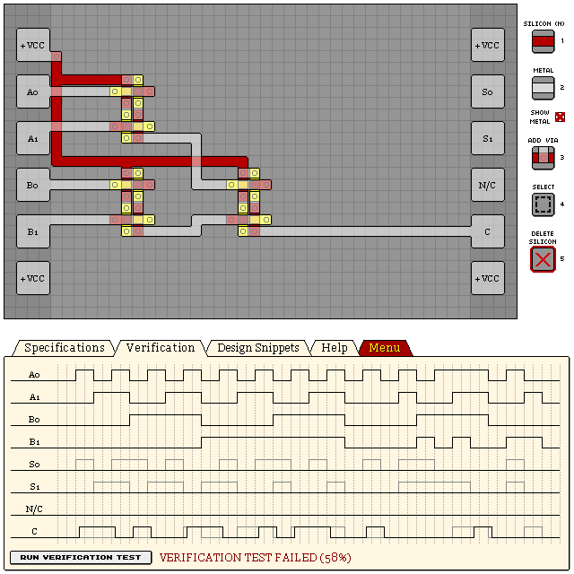

## XNOR Gate

<a href="https://openkonstruktor.natecousins.com/?level=10+KA180+2-BIT+ADDER+WITH+CARRY&design=eNrtmkESwiAMRaVh0zN4BfeexftfRKfiyGhIgRZh7CuDm%2BdvaRo%2FQeov%2Fjzf3Hx1%2FlTTEA4vdN7VCKfQioUutIqhZlyPBDiWUMmkHKGavTlCNXvzhqpkL88RIUKEPxUu5dyUPhYqImrfTh889NdnfN0d6PNIUv1%2BVV1EwxfSdLLpx3iPQ99RUWgU0mJqn5mnMC5d%2BR11cKSUE2ZZJRQKhR6bYpXGfFdPiWQFTVSGWZRIQrHKTmYo5sJB1pYVpFap3UUhLaYYKRSr7FY3ttNilT%2FWQqFYZTMqds2JVe5Nxa45sUro%2BFY59B63TdN73KsLcPa4R9oBZ4%2F7P6nYa7cmjtTUKvW%2BnTafHb7f%2BcnSakUj8ywUOsafYB0c6Q57gMcH" target="_blank">View in Open-Konstruktor</a>

Output is low if only an odd number of inputs are high, else output is high. For a 2-input XNOR, it
is only high while all or none inputs are high.

```
eNrtmkESwiAMRaVh0zN4BfeexftfRKfiyGhIgRZh7CuDm+dvaRo/Qeov/jzf3Hx1
/lTTEA4vdN7VCKfQioUutIqhZlyPBDiWUMmkHKGavTlCNXvzhqpkL88RIUKEPxUu
5dyUPhYqImrfTh889NdnfN0d6PNIUv1+VV1EwxfSdLLpx3iPQ99RUWgU0mJqn5mn
MC5d+R11cKSUE2ZZJRQKhR6bYpXGfFdPiWQFTVSGWZRIQrHKTmYo5sJB1pYVpFap
3UUhLaYYKRSr7FY3ttNilT/WQqFYZTMqds2JVe5Nxa45sUro+FY59B63TdN73KsL
cPa4R9oBZ4/7P6nYa7cmjtTUKvW+nTafHb7f+cnSakUj8ywUOsafYB0c6Q57gMcH
```

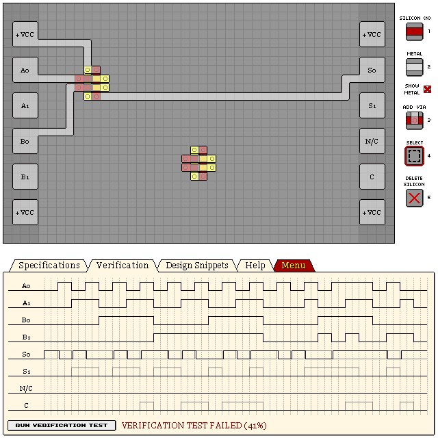

### 4-Input XNOR Gate

<a href="https://openkonstruktor.natecousins.com/?level=10+KA180+2-BIT+ADDER+WITH+CARRY&design=eNrtmWESgiAQhWOXP56hK%2FS%2Fs3T%2Fi9QoNSjLghKjwJNxHPt6IbC%2BVtc%2B7H16melp7O1Ia1RIYsvukZQzCI8LjTUroX%2BuCv31i65nKDSu%2Bf0LfUoh5%2F8%2Bbc6zY5WOBjmECWFm5MhxRPs9Z0fkaJHUuq9CCCGEJwvndI7i20yZWdzL6YfT8h3yjvSjy6frY%2FOU3ThZHK9OE3O1zKd%2F3EW%2Fm0i18Van%2BlUlr1mjsdkAvS6t6UgxJ8yySlBQUNCxKazyBFqSr446kyX5KqIOtAOr5PHMkN2oWXzo0GnHRqo%2FgKsPaDqFkYJ2klXy5m1EB9S9blRvUlZt9pi2ZVpiaDBD0P6zyqCW0P1CCHWbkBLj9vetMFX0wVyBXsAq%2F1DjdjkF0xA17pIKeN0at0rL3wqeVAFHjXswWqfG%2FRerlPdyGruD8Y92BnXZPVYB9OK0uiOF2xtyqMfV" target="_blank">View in Open-Konstruktor</a>

A 4-input XNOR can be achieved with three 2-input XNOR gates.

```
eNrtmUESgyAMRUvCxjP0Ct33LL3/RaoOOKghougg+GWcio+UIuE3Evux7+5nuq+x
ryOlUkMSS3KPpNRgeNzQWDMzDOuqYTh/0flcGxpXwv6FPiWXC7+fFvVkX6WjTg7D
DcNEz5H9iPZrzg7P0Typdl2FIQxhWNhwDOcofoyUmcUzn/acekUbbwQXU8/kb9vX
/Or8FuS63uK0iWkvZTdsFoevU/J3ZTo+4NnnLuoPic49SR72cvin09iPS6EDnqZS
XAbAEu4nuzz3LdIaXKlgMeVMklZQUFDQZ1NIZQGaEbA+9knmxLHwOtAGpJKfJ4bs
Rs3ie7JOGxZS/cU8tqeQQCGkoI1ElbzYXmuAut1IdZGyKrPHbGumOYIGMQRtP6pc
pRqanwghrbOmxFj+oRRuJYPwrEBvIJXZOfEhZvCxw8l7dxXSkilwlebvChbKjJNO
9fGC1kevyXGfIpXymU9jKxj/aCWoi+4xC6A3p5cr0vr4A+szyDU=
```

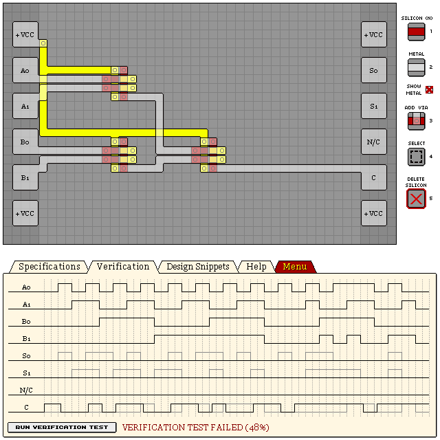
