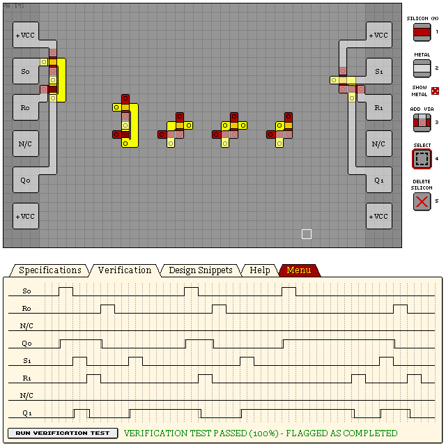

# S/R Latches

## Various

SR Latch snippets from left to right:
- Simplified - Largest footprint, accurate
- Compact A - Small footprint, slight lag, least accurate
- Compact B - Small footprint, accurate, output is center P-via
- Extra Compact - Smallest footprint, no delay, accurate. VCC and S short circuit while active.

This example shows Simplified and Compact A in use:

```
eNrtWkFywyAMLFpf8oZ+Ife+pf//SB2UJjUGkRA3CCQz9oxn0WgBaxHg5bx8nr7D
6SssHy1lYEOKz/CsYYiFYnnaI7UZWhiOAwwrI1oyrI6o5JHaDHv1amgzbGwj92yj
x4G+Ve9V0706r65Sm6HYlzWPzfNj8PkxGsZ0jspXRAFk79fRFV8LXd6J3/76jQDX
5ytBJc5jo/em6uK84bVHnfO8nFkwShVwrZHDf2N3Re/Kk9a51csF+hXdahfeplGl
/nlIPB111FFHbaPqpRLJtGpimKA2/5FQrbmxc+6KQrYdJroVSKUohrwkNyaGu0Zr
CVKSWKFbgFf82uKsTQxRE0MMIqTapZI3LqzljZBFSWk+0y3bMcZ5sLzRs8r3oHzS
UxZSYMLl+a7RiZACnfIK0a/Swynn3BdFRUjnksoDTr2peOqdn059S3m8PTTnbJRz
WQwhiuF28ZQ9CC/oxv+ccR8ilfn7dbSWhPM6Nf2pwMDvQx7CznmC7zm36EtjX4xu
dFKk/fUDr/bHZg==
```



## See Also

[06 KL2S1 DUAL SET-RESET LATCH](/levels/06%20KL2S1%20DUAL%20SET-RESET%20LATCH.md)