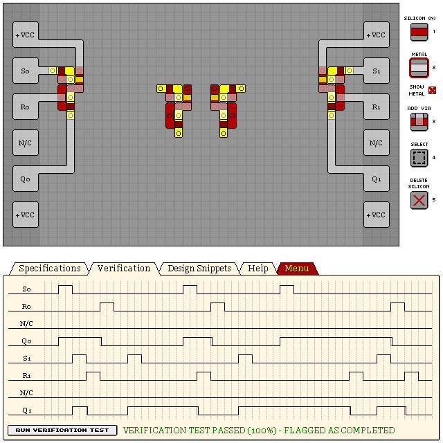
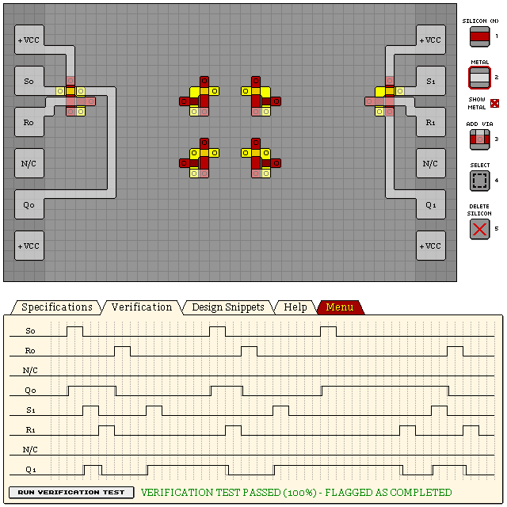
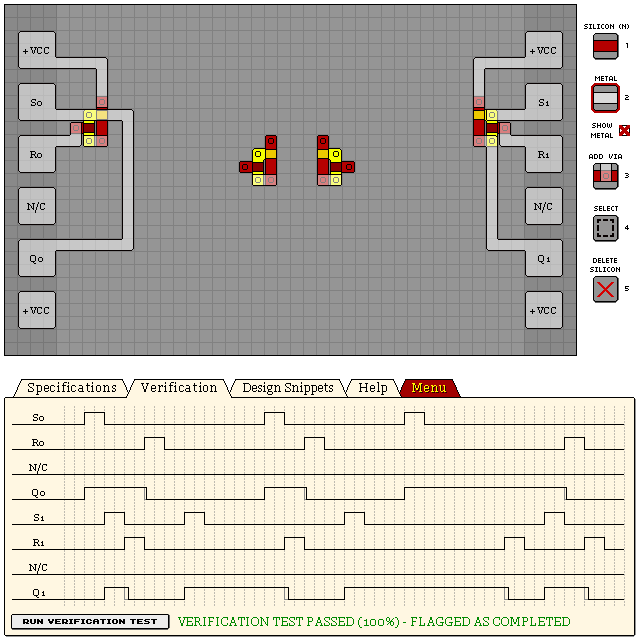
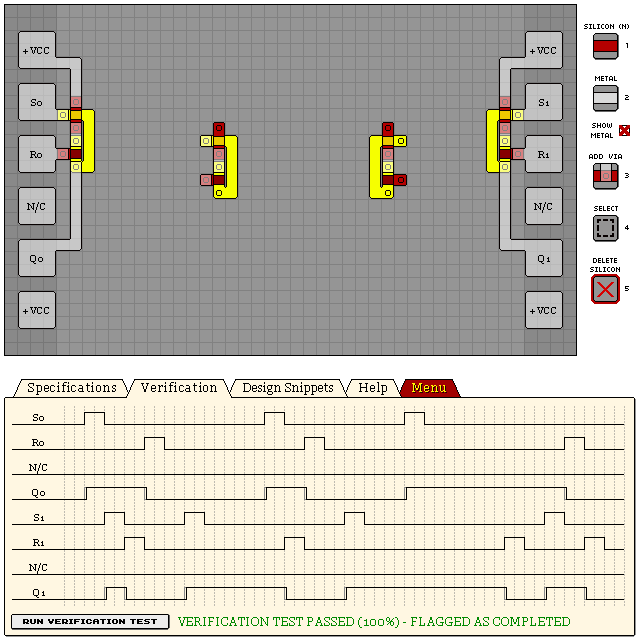

# S/R Latches

## Accurate

[Open in Open-Konstruktor](https://openkonstruktor.natecousins.com/?level=06+KL2S1+DUAL+SET-RESET+LATCH&design=eNrtWkt2wyAMrBlvcoZeofuepfe%2FSPPc9CV18UiIgGkZExbJPGHxmZGArG%2Fr6%2BVjubwv60ukzGmY4obLrRQb3kuRoet9s87jLIYpbmiunyNDc73mDR3rdZRRDbsaHpyK6RA7pjUMh4Bw0KkIc5rHasMtnUvHz4YCyNZ69Ip%2Ff9Lt28N7Hei1Wii%2Bnj26%2FYRsf%2FlozIrCQEFbRjOfEfZKs%2B9BOVMMllkMDXK%2FpSIdjYZLKgdGoSXdCYV6JHRmhv51qbTpgGMUWtLPQ%2Fcj3Sl%2FQ4VXmkEvigqWSSoHiUqgZAHbgmkDXpRlwdzqgrSMZj6HveI9Us7pZgplGWcoJJW9pBLKGztJJc7KGyuySu6zxPA5WSXnoDbgwwgpWMx6PGnOoaJDyVEGy8F%2BjfQObeUVbdnwivZIs%2B9lisEyytD%2FJpXn3nFbN%2BDJZasF3%2FhUMJ0lO7rjbotyHpVwcIwb8MZSma%2F1aBcq%2FYx6979AiA5ChdpS6WJKnmWtvDpBkT4ByWXHZw%3D%3D)

A large, but accurate SR latch. Rising/falling lag of 0/1.

```
eNrtWkt2wyAMrBlvcoZeofuepfe/SPPc9CV18UiIgGkZExbJPGHxmZGArG/r6+Vj
ubwv60ukzGmY4obLrRQb3kuRoet9s87jLIYpbmiunyNDc73mDR3rdZRRDbsaHpyK
6RA7pjUMh4Bw0KkIc5rHasMtnUvHz4YCyNZ69Ip/f9Lt28N7Hei1Wii+nj26/YRs
f/lozIrCQEFbRjOfEfZKs+9BOVMMllkMDXK/pSIdjYZLKgdGoSXdCYV6JHRmhv51
qbTpgGMUWtLPQ/cj3Sl/Q4VXmkEvigqWSSoHiUqgZAHbgmkDXpRlwdzqgrSMZj6H
veI9Us7pZgplGWcoJJW9pBLKGztJJc7KGyuySu6zxPA5WSXnoDbgwwgpWMx6PGnO
oaJDyVEGy8F+jfQObeUVbdnwivZIs+9lisEyytD/JpXn3nFbN+DJZasF3/hUMJ0l
O7rjbotyHpVwcIwb8MZSma/1aBcq/Yx6979AiA5ChdpS6WJKnmWtvDpBkT4ByWXH
Zw==
```



## Compact

[Open in Open-Konstruktor](https://openkonstruktor.natecousins.com/?level=06+KL2S1+DUAL+SET-RESET+LATCH&design=eNrtWltygzAMrLX85Ay9Qv97lt7%2FIu0EMlOIJMeWATusgR8WP6VdyyOmr%2Bnz9pNu32n6qLmuWlHqKqblqupR8r3qc0y047Urprwz5FzOdD%2FfyR2Hz9FKxlEAqVOA4sWpMkfAAUird1SA%2FTed0DZHOwYr3sM5scsdBaA%2BcfQPl%2FmbuWDV7wMVC50bM1BxWxa35dU7q%2BVHUVBrJUdGsVmVEpRjHhyFj8JAF4YaTMmw2%2BHvnopkrcZLUkmUKFGi10aHl0pEdkM6QGlcAc8K6NI3UDUjWr9VzAlKZRdiCAVf1QWFtIkYLgci%2FbiKf%2FehQuq2nBmVOyMKaRFTEGAopfKguJFRZQ9x41lRZWhUFMND4kZGlX2ggG9ESmUrUcLTem6tAKBD3zBH5c6I1i%2F2jTqGvplUNshxS2WOe%2FVSzTXvl%2BN20euRZcR8MXPcJ2fAXf6%2BkAGX9hnwnaVSf%2BJo7JisbVjH7aTbPyBINKJENYYGmIKTFOm5%2FAK4cMdV)

A compact SR latch in two flavours.

- Output from latch core via (left, bottom snippets)
  - Rising/falling lag: 1/1
  - Output via somewhat awkward to reach.
- Output from bottom metal (right, top snippets)
  - Rising/falling lag: 1/2
  - Output easier to access at the expense of extra lag.

```
eNrtWkt2gzAMrDVscoZeIfuepfe/SNtA3iuJJMeWATuMCRsm/kmasXhiuk6fl+90
+UrTR8111o5S1zEtV9WMkp9V32OiH8/dMeWDIRdyZvj5Qe4EfI5WMo4CSJ0CFBun
yh2BACCt3lEBtj90Qscc/RjseEvnxG43FIB6x9FfXOb/zA2ree+oWOg8mIGKO7K4
Iy/P/kzkjX1vCmrZcmQUa1sUoVzz4Ch8FAa6cNRgSobfDoO31CTLGi+JJVGiRIme
Gx1eKhE5DRkApXkFPC+gy9hA1Y7o/VY5JyiVXYghFHzVFxTSJmK4vBDpr6v499tV
SN2RM6tyd0QhLWIKAgylVO6UNzKr7CFvPCqrDK2KYrhL3sissg8U8J1IqWwlSniy
56MXAHQYG+aq3B3R+8WxUcfQN5PKBlVuqaxyrx6qteZYlbsaPR9ZRqwXs8Z9cAXc
5e8LFXBpXwHfWCr1O47GXpO1A2u/k/TxCwgSjShRjaEBpuAgRXpuP6FVx1k=
```



## Extra Compact

[Open in Open-Konstruktor](https://openkonstruktor.natecousins.com/?level=06+KL2S1+DUAL+SET-RESET+LATCH&design=eNrtmlEOgyAQRAvjj2foFfrfs%2FT%2BF2mDNo0Nu%2BiuSoSR%2BNOXDcgywxI6PIb7%2BArjMww3S%2Bs3MNgCY2qbA8PcmA4Gnh4YbIGFpS4FFpd6A7Pq%2BEbjrDrySHV0GujYdIzbnGNjZR6%2Fgamci%2FKTKIDs66cfnl7M3WHR70yhUjkWqS%2BBLn7L09%2BTodJcdUzhoL2Nqhk6yQMSnRQq6Miu7iMdSfreVVZJSkpK2je9vlVCo2CKT6PQKCqNCo4xM78rKRwKpVWeaIaQqXI04ILf3QyVwywqHXUL%2FUIfFY10FS2oDLoGL2OkDVglF23XdSOrSlaVtMpVadISAYBL%2BixT0mwHqGNKhX5Bq9yjqtRVhp6s8vA77gKNptgYi3fcKqUcdr1r5qiapMgXjjvo96gb8IOtMv%2F6qf8AriQxs51tq1f%2F%2F%2BNAsZCSbleZqiOTuis40htYIccB)

A very compact and accurate (Rising/falling lag: 0/1 or 0/2) SR latch. This SR latch causes the SET
pin to short circuit with VCC, causing SET to stay high until RESET.

Using the bottom pins allow easier access to the output, but introduces an increased falling lag
of 2. Connecting the output directly with the SET input results with a small falling lag of 1,
making this design one of the most accurate.

Because of the short circuit, it is not recommended to use this design unless aiming for a low
design score, or you are not worried about the circuit of the SET input.

```
eNrtmlEOgyAQRAvjj2foFfrfs/T+F2mDNo0Nu+iuSoSR+NOXDcgywxI6PIb7+Arj
Mww3S+s3MNgCY2qbA8PcmA4Gnh4YbIGFpS4FFpd6A7Pq+EbjrDrySHV0GujYdIzb
nGNjZR6/gamci/KTKIDs66cfnl7M3WHR70yhUjkWqS+BLn7L09+TodJcdUzhoL2N
qhk6yQMSnRQq6Miu7iMdSfreVVZJSkpK2je9vlVCo2CKT6PQKCqNCo4xM78rKRwK
pVWeaIaQqXI04ILf3QyVwywqHXUL/UIfFY10FS2oDLoGL2OkDVglF23XdSOrSlaV
tMpVadISAYBL+ixT0mwHqGNKhX5Bq9yjqtRVhp6s8vA77gKNptgYi3fcKqUcdr1r
5qiapMgXjjvo96gb8IOtMv/6qf8AriQxs51tq1f//+NAsZCSbleZqiOTuis40htY
IccB
```



## Simplified

[Open in Open-Konstruktor](https://openkonstruktor.natecousins.com/?level=06+KL2S1+DUAL+SET-RESET+LATCH&design=eNrtWkEOwiAQFKaXvsEvePct%2Fv8j6hITCRToAkrLSKiHcUMzuzNsi8ttua4Ps97NctGMgwdauZq9gUaGlbF7RasLnCEdswRmyy4eWFB22ytaXSDzyEBtkatKrqrIVbJiHntsrKptrmpjVW3lJ0yHtHN2%2ByMogOisR1%2B4m3DLwVtXot8%2Fl2%2BJ8tDUPc%2BK4ovESCxArv6PMgsF6k45Q09H2rrnIqskSpQo0bnRA1hl0Ccxib16TnLFLFDdI1tlki7XolNoLWQYckkmf49msjCVkWbUPZKRjm%2BVn3cWFFqDjiXgkkz2ygLNsEi%2F7Cob7jsI3oJ7VAN8PC%2FuZwIufQkDfDBsY5UpJjNZOJ1VphSaUffhrLLrGbe3HM%2B4iRKdBU1rv9cJeGerjM96NEsmHFn%2BvwlYeGqUHTizMI5VqtX9B0d6AqxqxxU%3D){:target="_blank"}

A simplified SR latch for illustrative purposes. Rising/falling lag of 1/1.

```
eNrtWkESwiAMFNJL3+AXvPsW//8RbbAzIBAwhdrK2qk9bNJ0ssmSitNtus4PM9/N
dNEcJ3e0/G2+dTR8WD6+jmh1jiPQMYpjsezSjhVll49odY7gEY7aIleV3KYiV7UV
eOyxsKqWuU0Lq2op/0M6eJyz+Q+jRJQ8t6Mv3J3kwlEQl70Xc76yV4BKzzwqSl4S
P1BH+ZJOvuZMfNtUjBqLF7CWmM0YeTfIWYQBh4F9ltImQYJFMj0WMlY2MBKqLor0
64KXxWEVlvcj026KlnvoKqkFChQo0LHRE0hlNGeBxB4zK3IFFtDdR5dKMV1uRkej
tWjDOJfI5P5ogYWhhLTQ3UcS0uNL5fqjBRqtwcQS5RKZ7MUCxLCqfzFVNlx3eOHJ
p5oIr+fV80yUy7CFifBi2EYqpUwWWPg7qZQ6tNDdp5PKrnvkQTjskQMFOgoq976k
G332uJtIZfrcjhaTSS5Z4d8JUHhqFBM4WDiOVKq7+weK9ATIg8eV
```



## See Also

[06 KL2S1 DUAL SET-RESET LATCH](/levels/06%20KL2S1%20DUAL%20SET-RESET%20LATCH.md)
