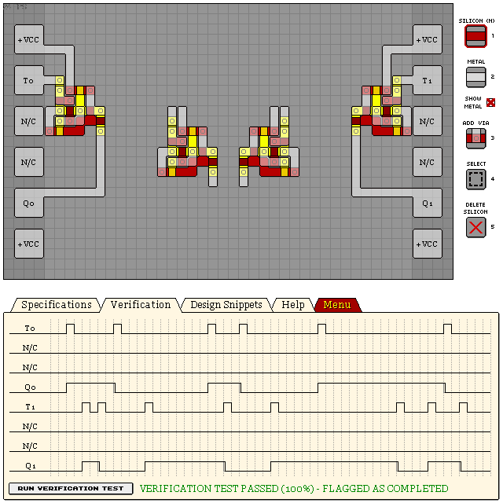
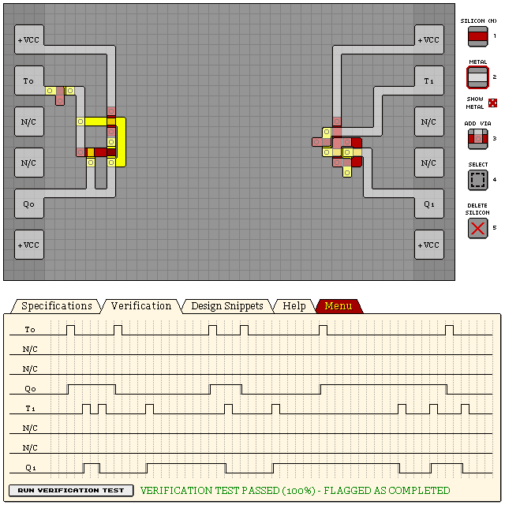

# T Latches

## Edge-triggered T Latch

```
eNrtWVGywiAMfLD98QzvCv6/s7z7X8QZxDq1EEoipNDYaa1d15AAayDLffm9/bvb
n1t+OIcRexB94u4A0W2IrotFF+287w4QfTjSn9pYFPg41ACYvzv6D/Kri5XnEXcD
osbiZgh2scgOTm+LNlaNuCGGdM7nXwEFkDzlKG23jGK9VKPA+/pNLhDci28pLuKF
4VGzWFGtKnvUJpKy/hXFqgIFhT4jlhzta0RTaAw4waXtrhFltLmAktGAL0eDx9VX
pENSOSd6iol2edR6ob+AW6w46IWlsl2G9vEvOYQ4zOfRCJIFkzuTyqmnf1g1IcPF
bkXx0Wbsf1h9AU62quARGY3pRRj8Ben6hQxXIqQmwiaVfXYyRbug55z+7drcDr10
3tgONTE0qaxA4fmT9LnhnuHG57lSBcnVi4aSR5JeGACFoPgCidyZVOpIpWaNu13e
KMnByLqtZEGql1VSbRbVqbV68BwLcLqKLahxS6SymZBCgNbY1VCkg1KZPuXooFkl
heI1PYCB8iiqVSWPztgLowhpZq9yE+lpskrge1LZXZEesZTHsQ==
```




## Edge-triggered T Latch in use with simplified variant

On the left shows a simplified implementation of this T-Latch. At it's core, it is a simple
SR-Latch, with both S+R inputs connected, forming T. R is only available when the output is high.
There is a major problem with this approach: the latch will oscillate while T is high, as S will
allow R to open. To combat this, we pulse T through a PNP gate to take advantage of the propagation
delay within the latch.

```
eNrtmkGWgyAQRIVykzPkCtnnLLn/RWYGTB46NJBWEJLC5+pT9rPtLkWdb/P18jCX
u5knzTa40OqFpnHEUG70QtsoonGbddvbEa1O+Nm1SiGFFA5/7/DGqIxo81EPjjjY
/ZHCyT/OWXk4CiC676e/3O/z5ONhFXjBSOOc2o2/STFsXREt86L8Of7R5cD+hLY0
lU/SV+JlHtR2YgYzKlKkaFCwcfoa0aoXe2IVV2hmvVagNf1JynORcXZcAAfEBRuN
lHTY/m1FB7DKbilos6QfY1n4Brsb3iqrXsS8oUF3Rn4hzjYkHWMBnq/nhBan9S+t
sjxdO5OZtsqdlFZJ+g3PjTivf2mV47+r9N93ZCMFuDwn7YYiY2jQa8/t366s8pAv
3tvEFVNbTaulbEPSARfgKLPKth3a/gt4ZauM7/tp7bvS+kcH6V1lMKPoyM+jQqEl
Je3TSLf/CgXV3t2q8ARH+gHyjcdH
```



## Older T Latch design

Bulkier, but more accurate. Mirrored T Latch snippets:

```
eNrtWkFywyAMLFpf8oZ+Ife+pf//SB2UJjUGkRA3CCQz9oxn0WgBaxHg5bx8nr7D
6SssHy1lYEOKz/CsYYiFYnnaI7UZWhiOAwwrI1oyrI6o5JHaDHv1amgzbGwj92yj
x4G+Ve9V0706r65Sm6HYlzWPzfNj8PkxGsZ0jspXRAFk79fRFV8LXd6J3/76jQDX
5ytBJc5jo/em6uK84bVHnfO8nFkwShVwrZHDf2N3Re/Kk9a51csF+hXdahfeplGl
/nlIPB111FFHbaPqpRLJtGpimKA2/5FQrbmxc+6KQrYdJroVSKUohrwkNyaGu0Zr
CVKSWKFbgFf82uKsTQxRE0MMIqTapZI3LqzljZBFSWk+0y3bMcZ5sLzRs8r3oHzS
UxZSYMLl+a7RiZACnfIK0a/Swynn3BdFRUjnksoDTr2peOqdn059S3m8PTTnbJRz
WQwhiuF28ZQ9CC/oxv+ccR8ilfn7dbSWhPM6Nf2pwMDvQx7CznmC7zm36EtjX4xu
dFKk/fUDr/bHZg==
```


## See Also

[07 KL2T1 DUAL TOGGLE LATCH](/levels/07%20KL2T1%20DUAL%20TOGGLE%20LATCH.md)