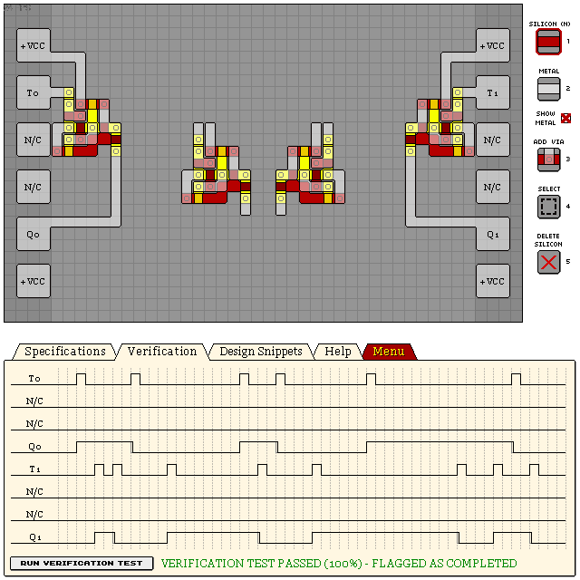
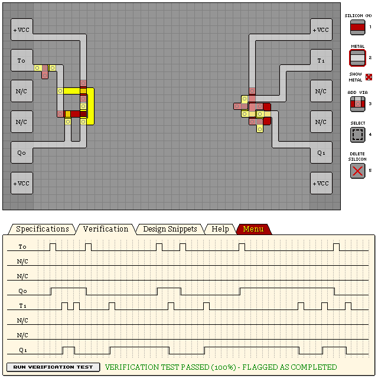

# T Latches

<a href="https://openkonstruktor.natecousins.com/?level=07+KL2T1+DUAL+TOGGLE+LATCH&design=eNrtWlGWgjAMlI4%2FnmGv4P%2BeZe9%2Fkd3nc7FNkwmkFVAL%2BuMQmqZhmCaer%2Bevy890%2BZ7Op8g5DA9uOMUM03yuNJzuZ8jV0Iin%2BIgjcw5jyG4y2YYsT6vfc0OWpxUmXbXzVGDS0M5TOuJLrWNwjsGohtcxnDnhXN17HR2aZIaUmC3DKTqi%2Bxpgrg5evcm5ZB83FID6bUf%2F8Nvn%2FwDycSWaNkQBzM5UaAFK9H6BjRYTVtDsqFFrjXw0d3n28IGKcMC2TdKWjoviVy2S8r6ZrTZsjvIZKQMvRJ1Ixu%2FMfabz9WLF4rwsc0rnKrQco0Sh22aZrKEPQwt9XLQZI1mxWkSVAx3oQAf62eigSguFeE%2FbylC7c4vtJ6Fg2t7VfhrcRTc2qfdn%2BezE6tkrCG6LsC0GVR6fDGnCK1yZpzQjQzDbjyPDRAsdCXLbbxVnJLGUUYYsGhwzGsxnPl8eqx4b8AZUZnyBghIpXoRIB1Xa2i%2BuDMFtB1XmVdCWuh%2BpZO5HhtQrp84Jqir3JcO4bhyq8p1RULrTwMU0i7EBz8v%2BhTSRqPasWsRSac4a3EY3snGZz3y%2BPFZb6EZKhkw3Ulu8E1V27XHLh2W3HreDJt7jTgz1ety7aAO11GWqnW6b2RZVqbblt%2Bhxt1QjV9UbcSRVSXvcTgc8mT1u2zbvcZuoyhvP6XF3oUr9247KA8dRlaQaqZUi04q2jrfxl%2F8V6qWT49tVqt9aVCV9jbrkQFskL1H2wZq6Lo1VD6oE4vOFtWtQnpYy232f84s2ZqT5%2BAXcM8iE" target="_blank">View in Open-Konstruktor</a>

This T-Latch comes in two flavours:

a) Larger but very accurate. Rising/falling lag of 0/1.

b) Slightly smaller but less accurate. Rising/falling lag of 1/1.

```
eNrtWlF2gzAMKxE/O8OusP+dZfe/yPpYVxxjK+CkQNtA+7EKE8cxQrE3fo2fHz/D
x/cwXiJnNzy54RAzTPdzo+FwO0Ouhka8xEfsmXMaQ3aTwTdkebr4XRqyPF1g2lU/
TxWmDf08pSM+1ToG5xiMangdw5kTztWj17FAk8yQErNnOERHLL4GmKudVyc5l/xj
QgGY33r0ik+f/wOQ42o07YgCuDuzQDNQo7cLfDSbsIGKY4GOF2+R+BLebiwj/ffX
jKp4wLdN2paOi+xXK5T6vsLWGlaifEbGwCvRQiTjd+Y+0/mWYsXiXJrR7I7MMA1f
Pz6cu6celgmz0NnQQ+eLdiMlL1qr2LKjHe1oR98b7VTpoVBval8cWneusX0nFEze
F9WfBTdRjjXow3wuxOrRKwhui7AtOlWenwxpwhtcKVOakSGY7duRYaK1jgS98ffq
M5pY8ihDlw3OGQ3mM58vj1WLLXgFqjM+Q0GJFE9CpJ0qfe0XV4bgtp0qZR20pvJH
apnHkSH1qlDpBFWVx5JhXDd2VfnKKCjdWeBqmkXfgMuyfyZNNGo9qx6xLDTnEtxH
N7Jxmc98vjxWe+hGSoZMN1JbvBJVNm1z64flsDZ3AU28zZ0YWmpzH6INzFKXq3aa
bWZrVKXZmN+jy11TjdxUb8SZVKXdiV6F6nqVeI58W9njdlGTNx7T425Clfa3HtUH
zqMqSTXSKkWmDW2d0sZf/7tQK50c365S/VajKulrtEgOtEXyFGUfbKnr0li1oEog
Pl94uwbjacmzveyzvGhnRrofv0gYyIo=
```



## T Latch in use with simplified variant

<a href="https://openkonstruktor.natecousins.com/?level=07+KL2T1+DUAL+TOGGLE+LATCH&design=eNrtms2xwjAMhLE3F2qgBe7UQv%2BNwDgB8mNLQcLByWw8ufCx1iNZayT7ddfucr6H8y10J8vYuTDahWHjiGN5sAvjRhFDGjGNryNGm%2FDYXqWQQgp1YbAJhYwjCcN7mP7UYlRNaIxI5xxfmMq5WL4SBZC9%2FfTJh7u%2FMIk7UIhU0aarQF9CQKA57TBr%2F1PmVHqSpKQrKCQ6ctzSk8AUz%2Fw8w3MaszN%2FaGGlfD43rFATrZmRSu9oVar8L0XluOAiJSUl3X%2BqbJaCaZa0tZpT9SRYNuw4VSp1I1w1J3zmKc%2FcN%2BC0FunGDbjkZyh%2BnlqWb%2BFYqdLZgMup0kmZKklbqxtFmt3J5Fs4SAPe6l5lf65TTqQA2xnS31NIiVR1HZSak8%2FZlSqrn3GLNFbTWinNQ9paA45sh%2F31GbdIbWuwtRPwyqkyf%2Ftp7apy8c8T2b3K0TdWzfyaFQYtKamzqhQ8CbV592wZoeD2xRqr%2FjT%2BkJEe2hDHRg%3D%3D" target="_blank">View in Open-Konstruktor</a>

On the left shows a simplified implementation of a T-Latch. At it's core, it is a simple
SR-Latch, with both S+R inputs connected, forming T. R is only available when the output is high.
There is a major problem with this approach: the latch will oscillate while T is high, as S will
allow R to open. To combat this, we add a PNP gate in order to trigger T with a short pulse so that
R does not receive a high signal, as it's NPN hasn't had enough time to open.

```
eNrtmlF6gyAQhAPjS87QK/S9Z+n9L9IW0WiAXbOIQTv6+ZKfYRMc9lsgw+fwcf92
9y833Cz3yYXeLnQHR1zKnV3oD4rowu3D/XJEbxNe26sUUkihLnQ2oZBxJKGbb9NX
LUbVhMaIdM71haGc8+UrUADZp57+8vEZbmM8rAJHDBlr6nD9NcphH2ZUbJfl05XQ
2PH4g56pNJ6k88CX+cLbQov/MGaQ6MJ5qTeBNZ5otHxsl/I5cLbvBy3Mmcfnlvmq
4ux8bJmjSu9pU/J8L0XjuGByIyUlPX+q7JaCaZa0t7pT9SRYNpw4VSp1I6pqTtSZ
p9zzuBintUgPXoRLfobi57Vl+RaulSorF+ByqqykTJWkvdWNIs3uZvItXGQB3ute
5XjGU06kAJczpPtTSIlUdR2UmpPjXJUqdzn1fk5Mm6lvprVSmoe0twU4sivsl0+5
RWqbgy1omzPuXVJl/qmnravK5A8U2b3KRYtNPU+9wqAlJa2sKgVPQl2812wZoeD2
ZI41H403ZKQfNXDHag==
```



## See Also

[07 KL2T1 DUAL TOGGLE LATCH](/levels/07%20KL2T1%20DUAL%20TOGGLE%20LATCH.md)
