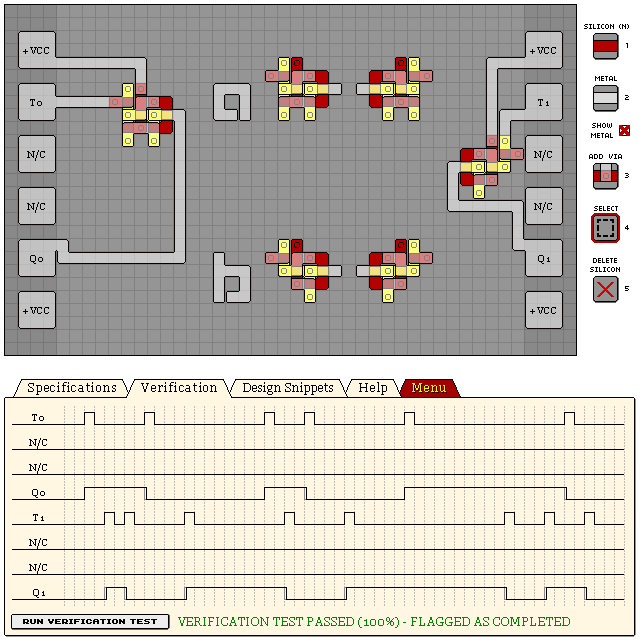

# T Latches

## Edge-triggered T Latch

```
eNrtWVGywiAMfLD98QzvCv6/s7z7X8QZxDq1EEoipNDYaa1d15AAayDLffm9/bvb
n1t+OIcRexB94u4A0W2IrotFF+287w4QfTjSn9pYFPg41ACYvzv6D/Kri5XnEXcD
osbiZgh2scgOTm+LNlaNuCGGdM7nXwEFkDzlKG23jGK9VKPA+/pNLhDci28pLuKF
4VGzWFGtKnvUJpKy/hXFqgIFhT4jlhzta0RTaAw4waXtrhFltLmAktGAL0eDx9VX
pENSOSd6iol2edR6ob+AW6w46IWlsl2G9vEvOYQ4zOfRCJIFkzuTyqmnf1g1IcPF
bkXx0Wbsf1h9AU62quARGY3pRRj8Ben6hQxXIqQmwiaVfXYyRbug55z+7drcDr10
3tgONTE0qaxA4fmT9LnhnuHG57lSBcnVi4aSR5JeGACFoPgCidyZVOpIpWaNu13e
KMnByLqtZEGql1VSbRbVqbV68BwLcLqKLahxS6SymZBCgNbY1VCkg1KZPuXooFkl
heI1PYCB8iiqVSWPztgLowhpZq9yE+lpskrge1LZXZEesZTHsQ==
```




## Edge-triggered T Latch in use with simplified variant

On the left shows a simplified implementation of this T-Latch. At it's core, it is a simple
SR-Latch, with both S+R inputs connected, forming T. R is only available when the output is high.
There is a major problem with this approach: the latch will oscillate while T is high, as S will
allow R to open. To combat this, we pulse T through a PNP gate to take advantage of the propagation
delay within the latch.

```
eNrtmkGWgyAQRIVykzPkCtnnLLn/RWYGTB46NJBWEJLC5+pT9rPtLkWdb/P18jCX
u5knzTa40OqFpnHEUG70QtsoonGbddvbEa1O+Nm1SiGFFA5/7/DGqIxo81EPjjjY
/ZHCyT/OWXk4CiC676e/3O/z5ONhFXjBSOOc2o2/STFsXREt86L8Of7R5cD+hLY0
lU/SV+JlHtR2YgYzKlKkaFCwcfoa0aoXe2IVV2hmvVagNf1JynORcXZcAAfEBRuN
lHTY/m1FB7DKbilos6QfY1n4Brsb3iqrXsS8oUF3Rn4hzjYkHWMBnq/nhBan9S+t
sjxdO5OZtsqdlFZJ+g3PjTivf2mV47+r9N93ZCMFuDwn7YYiY2jQa8/t366s8pAv
3tvEFVNbTaulbEPSARfgKLPKth3a/gt4ZauM7/tp7bvS+kcH6V1lMKPoyM+jQqEl
Je3TSLf/CgXV3t2q8ARH+gHyjcdH
```


## Bulky Edge-triggered T Latch design

Bulkier, but more accurate. Mirrored T Latch snippets:

```
eNrtWltygzAMDNr85Ay9Qv97lt7/Ik0Jb6QVliFgCAydTBdhW9auZMP9+/71+K0e
P9X9FjlPZFilGUp3VqktVs9T6r/JhhI1vLGOcufIRQJgT0OJGCqzutRwFkdLDauI
ocoV3bDy2Tk0XMBCq0WXhbahRA05C6lzJMerK81jVuQEYzXMjvNKR0iQwykgI+mE
0lxGYg2m8pNFTl3OiX3UKAD1ykefeHuh/dW32yEvcI42h6hoe6B/wAwd/F+3pagc
GQVB+2Ebts0N/yjmCHrbsQOHnu5th/e0v1/ttvdDHVHblopi2M8p2gWZ3u4oXKZ9
Fjpe7qtkPx8rcli0u0xRWcYZ6rCbKMOWimT5apFUHgFFdIozwuPgYriZkGbY9vjy
XoGgILZwnowEX2EnXxWEbskyFOCNMqQSck1BKxBFoi0K7PMHvSK7DySVZmapC2S2
NBDslQ0vWDfSBelgqqy6EeMFmgCkboQgWjfCqRvh9HnReM9Vc27FFMpQh93HqTlL
kMq5ryeT6KA4qRjmSCUVh86heg0GZ4mNlCW2qoa93DlogpBGR8S9wT1Z2AKcSyUt
VygHOX8/C/D1UGTVjRm2V92rjNdR7kuQSa+QVTdm2Kb0eSNfnWqvMs4yl91FSeU6
77j1fSGM7tDQJmmxPSXEd5wuWVW6T569xZ6UWTaqtAu+Vwm6W2WJIXjE6st+c68S
S73x1lk4khi6T0Y6f33uW7qxzTvuVaRSv/LRUV4yyQK7JlG+FtE/YzCz4RWrSjhp
ZfxJjzVNr89yVM0ZSyXm9s3nQPQtNuCNyJr9LsiMdv0+W+NN8ZXv54JQjyk6y3yG
wt8FxT6KNDn+ADSIyH8=
```


## See Also

[07 KL2T1 DUAL TOGGLE LATCH](/levels/07%20KL2T1%20DUAL%20TOGGLE%20LATCH.md)